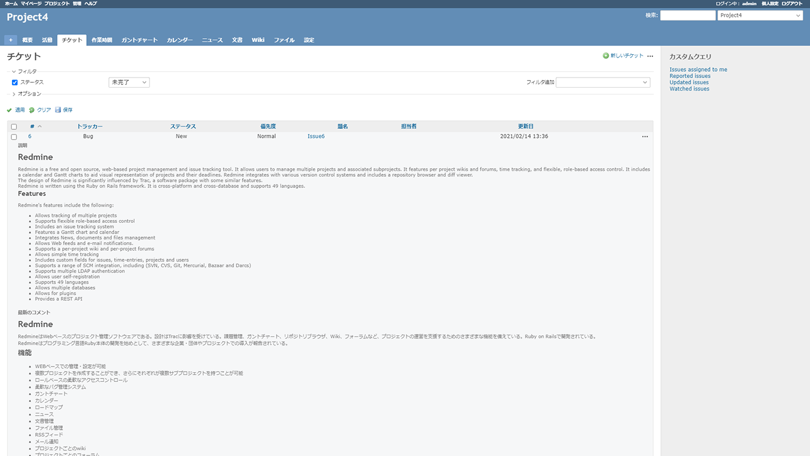
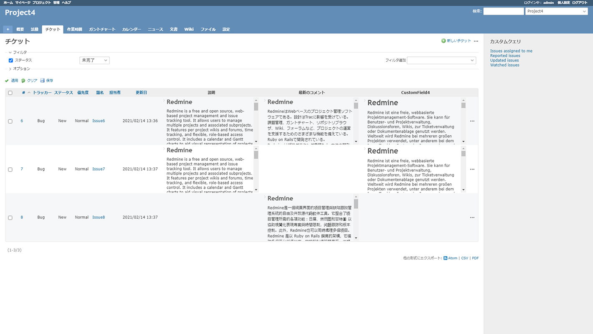
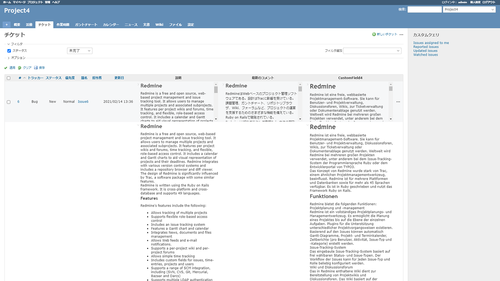

# チケット一覧画面でワイド表示項目を1行内に表示する
## 説明
チケット一覧画面でワイド表示項目を1行内に表示します．  
領域からはみ出した内容はボタンでの開閉またはマウスホバーでの開閉が可能です．

## 動作確認済環境
### Redmine
- 4.1.1
### ブラウザ
- Chrome 88.0.4324.150
- Firefox 85.0.2
- IE11

## イメージ
### プラグイン適用前

### プラグイン適用後

### プラグイン適用後（2行目の内容を展開した状態）


## View Customize plugin 設定
- パスのパターン: /issue$
- 種別: HTML

## コード
```HTML
<script type="text/javascript">
//<![CDATA[
$(function () {
    // --- 設定 ここから ---
    let MAX_HEIGHT = 150;  // 要素の最大高さ
    let WIDTH = 400;  // 要素の幅
    // let DELAY = 3000;  // マウスホバーで展開する場合の遅延時間[ms]
    let DELAY = -1;  // マウスホバーを使用しない場合（0未満の値を指定する）
    // --- 設定 ここまで ---


    var timer;

    // 折りたたみ/展開 ボタン
    var button_collapse_expand = $('<input type="button" title="展開する" class="icon icon-only icon-collapsed">').click(function () {
        var tr = $(this).parent().parent().parent().parent();
        var inline_wide_item = tr.find('div.inline_block_item');
        inline_wide_item.each(function () {
            var button = $(this).find('div.button>input');
            var content = $(this).children('div.content');
            if (content.css('max-height') != MAX_HEIGHT + 'px') {
                button.attr('class', 'icon icon-only icon-collapsed');
                button.attr('title', '展開する');
                content.css({
                    'max-height': MAX_HEIGHT
                });
            } else {
                button.attr('class', 'icon icon-only icon-expended');
                button.attr('title', '折りたたむ');
                content.css({
                    'max-height': ''
                });
            }
        });
        var tr_class = tr.attr('class');
        setTimeout(function () {
            tr.attr('class', tr_class);
        });
    });

    // マウスホバーイベント
    var set_hover_event = function (elem) {
        $(elem).hover(
            function () {
                timer = setTimeout(function () {
                    $(elem).find('div.inline_block_item>div.content')
                        .css({
                            'max-height': ''
                        });
                }, DELAY);
            },
            function () {
                clearTimeout(timer);
                $(elem).find('div.inline_block_item>div.content').css({
                    'max-height': MAX_HEIGHT
                });
            }
        );
    }


    // 移動
    var move_wide_items = function () {
        // get block items
        var wide_items = [];
        $('#list-definition .field:last+td input').each(function () {
            var $elem = $(this);
            if ($elem.is(':checked')) {
                wide_items.push({
                    'value': $elem.attr('value'),
                    'header': $elem.parent().text()
                });
            }
        });

        if (wide_items.length === 0) {
            return;
        }

        // generate cell
        for (i = 0; i < wide_items.length; i++) {
            var wide_item = wide_items[i];
            if ($('#content th.' + wide_item['value']).length === 0) {
                $('table.list.issues thead th.buttons').before("<th class='" + wide_item['value'] + "'>" + wide_item['header'] + "</th>");
                $('table.list.issues tbody td.buttons').before("<td class='" + wide_item['value'] + "'></td>");
            }
        }

        // fix colspan
        $('table.list.issues tbody tr.group td').attr("colspan", $(
            'table.list.issues thead:first tr th').length);

        // move item
        var target_rows = $('table.list.issues tbody tr[id^=issue-]').not('tr.group');

        target_rows.each(function () {
            var tr_dst = $(this);

            var tr_src = tr_dst;
            for (loop = 0; loop < wide_items.length; loop++) {
                tr_src = tr_src.next('tr');

                if (tr_src.hasClass('issue') || tr_src.length === 0) {
                    break;
                }

                var td_src;
                for (i = 0; i < wide_items.length; i++) {
                    if (tr_src.children('td:first').hasClass(wide_items[i]['value'])) {
                        td_src = tr_src.children('td:first');
                        break;
                    }
                };
                if (td_src === undefined || td_src.length === 0) continue;

                var td_dst = $(tr_dst).children('td.' + wide_items[i]['value']);

                // remove first span (header) if exists
                if (td_src.children().first().prop('tagName') === 'SPAN') {
                    td_src.children().first().remove();
                }

                // move elements
                var outer = $('<div class="inline_block_item"></div>');
                td_dst.append(outer);

                var button_outer = $('<div class="button"></div>');
                if (DELAY < 0) {
                    outer.append(button_outer.append(button_collapse_expand.clone(true)));
                }
                outer.append($('<div class="content"></div>').append(tr_src.children('td:first')
                    .children()));

                // set styles and events
                td_dst.css({
                    'vertical-align': 'top',
                    'width': WIDTH,
                    'max-width': WIDTH,
                    'white-space': 'normal',
                });

                outer.children('div.content').css({
                    'text-align': 'left',
                    'max-height': MAX_HEIGHT,
                });

                if (DELAY < 0) {
                    outer.children('div.content').css({
                        'overflow': 'auto'
                    });
                } else {
                    outer.children('div.content').css({
                        'overflow': 'hidden'
                    });
                    set_hover_event(tr_dst);
                }
            }
        });

        // remove empty tr
        $('table.list.issues>tbody>tr').not('tr[id^=issue-]').not('tr.group').remove();
    }

    // set event for list
    var observerUpdateList =
        new MutationObserver(function (mutations) {
            mutations.forEach(function (mutationRecord) {
                move_wide_items();
            });
        });

    try {
        observerUpdateList.observe(
            $('#content table.list.issues').parent()[0], {
                childList: true
            }
        );
    } catch (error) {
        console.log(error);
    }

    // initial invoke
    move_wide_items();
});
//]]>
</script>
<style>
/* 折りたたみ/展開 ボタンの設定 1 */
div.inline_block_item>div.button {
    text-align: right;
    overflow: hidden;
    float: left;
    margin-top: 2px;
    width: 16px
}

/* 折りたたみ/展開 ボタンの設定 2 */
div.inline_block_item>div.button>input {
    width: 16px;
    height: 16px;
    font-size: 0;
    padding: 0;
    margin: 0;
    border: 0;
    opacity: 0.5;
    cursor: pointer;
    background-position: center;
}

/* 列選択時のフォントカラー設定 */
/* テーマによっては設定を変更する必要あり */
.context-menu-selection div.inline_block_item>div.content h1,
.context-menu-selection div.inline_block_item>div.content h2,
.context-menu-selection div.inline_block_item>div.content h3,
.context-menu-selection div.inline_block_item>div.content h4 {
    color: #f8f8f8 !important;
}
</style>
```
