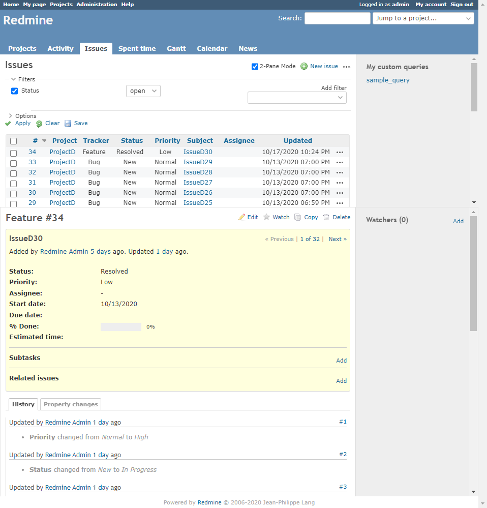

# チケット一覧画面2ペイン化
## 説明
チケット一覧画面を2ペイン化し，チケット一覧とチケット詳細を1画面内に同時に表示します．  
これにより，チケット一覧を確認しながら，チケット詳細の確認と編集が可能になります．  
また，チケット詳細画面で行った変更は都度チケット一覧画面に反映されます．  

## 動作確認済環境
### Redmine
- 4.1.1
### ブラウザ
- Chrome 86.0.4240.75
- Firefox 81.0.2
- IE11
### プラグイン
- [redmine_issue_dynamic_edit](https://www.redmine.org/plugins/redmine_issue_dynamic_edit)
- [sidebar_hide](https://www.redmine.org/plugins/sidebar_hide)

## 注意
- HTMLのDOM階層を変更しているため，その他のプラグイン等が正常に動作しなくなる可能性があります．
- チケット詳細画面内のサイドバーにはウォッチャー以外の項目は表示されません．

## イメージ


## View Customize plugin 設定
- パスのパターン: /issues$
- 種別: HTML

## コード
```HTML
<script>
    //<![CDATA[
    $(function () {
        // --- config/設定 ---
        // 2ペイン表示モードを初期状態とする
        var SET_INITIAL_STATE_TO_2PANEMODE = false;
        // 表示モードをCookieに保持する（Cookieに保存された値が優先されます）
        var USE_COOKIE = true;
        // 2ペイン表示モード時のチケット一覧画面の高さ
        var INITIAL_HEIGHT_OF_ISSUE_LIST_PANE = '30vh';
        // 2ペイン表示モード時のチケット一覧画面の最小高さ
        var MIN_HEIGHT_OF_ISSUE_LIST_PANE = 50;
        // ----------------


        var targetAnchor = function () {
            return $('#content table.list.issues').find('td.id a, td.subject a');
        }


        // ----- define functions -----
        // https://www.w3schools.com/js/js_cookies.asp
        function setCookie(cname, cvalue, exdays) {
            var d = new Date();
            d.setTime(d.getTime() + (exdays * 24 * 60 * 60 * 1000));
            var expires = 'expires=' + d.toUTCString();
            document.cookie = cname + '=' + cvalue + ';' + expires + ';path=/';
        }


        // https://www.w3schools.com/js/js_cookies.asp
        function getCookie(cname) {
            var name = cname + '=';
            var decodedCookie = decodeURIComponent(document.cookie);
            var ca = decodedCookie.split(';');
            for (var i = 0; i < ca.length; i++) {
                var c = ca[i];
                while (c.charAt(0) == ' ') {
                    c = c.substring(1);
                }
                if (c.indexOf(name) == 0) {
                    return c.substring(name.length, c.length);
                }
            }
            return '';
        }


        var showDetail = function () {
            var height = $('#main').data('height');
            if (typeof height === 'undefined' || height === '') {
                height = INITIAL_HEIGHT_OF_ISSUE_LIST_PANE;
            }
            $('#wrapper3').css('height', '100vh'); // support IE11
            $('#main').css('max-height', height);
            $('#main_wrapper1').css('max-height', height);
            $('#main_wrapper1').css('overflow-y', 'scroll');
            $('#main_wrapper1').css('width', ''); // support IE11
            setTimeout(function () {
                $('#main_wrapper1').css('width', '100%');
            }); // support IE11
            $('#iframe_issue_detail_wrapper').show();
            $('#main div.ui-resizable-handle').show();
        }


        var hideDetail = function () {
            $('#iframe_issue_detail_wrapper').hide();
            $('#main div.ui-resizable-handle').hide();
            $('#wrapper3').css('height', ''); // support IE11
            $('#main').css('max-height', '');
            $('#main').css('height', ''); // for resizeable
            $('#main_wrapper1').css('max-height', '');
            $('#main_wrapper1').css('overflow-y', '');
        }


        var visibleIframe = function () {
            $('#iframe_issue_detail').css('visibility', 'visible');
            $('#ajax-indicator').hide();
        }


        var hideIframe = function () {
            $('#iframe_issue_detail').css('visibility', 'hidden');
            $('#ajax-indicator').show();
        }


        var enable2PaneMode = function () {
            if ($('#iframe_issue_detail').attr('src') === '') {
                hideDetail();
            } else {
                showDetail();
            }

            targetAnchor().each(function () {
                // disable the original link
                if ($(this).attr('href') !== 'javascript:void(0)') {
                    $(this).data('href', $(this).attr('href'));
                    $(this).attr('href', 'javascript:void(0)');
                }

                $(this).on('click', updateIframe);
            });

            if (USE_COOKIE) setCookie('2pane_mode', 'true', 100);
        }


        var disable2PaneMode = function () {
            hideDetail();

            targetAnchor().each(function () {
                // restore the original link
                if (typeof $(this).data('href') !== 'undefined') {
                    $(this).attr('href', $(this).data('href'));
                }

                $(this).off('click', updateIframe);
            });

            if (USE_COOKIE) setCookie('2pane_mode', 'false', 100);
        }


        var updateState = function () {
            if ($('#cb_2pane_mode').prop('checked')) {
                enable2PaneMode();
            } else {
                disable2PaneMode();
            }
        }


        var updateIframe = function () {
            if (!$('#cb_2pane_mode').prop('checked')) {
                updateState();
                return
            }

            var $iframe = $('#iframe_issue_detail');

            if ($iframe.attr('src') === $(this).data('href')) {
                if ($('#iframe_issue_detail_wrapper').css('display') !== 'none') {
                    hideDetail();
                } else {
                    showDetail();
                }
            } else {
                hideIframe();
                $iframe.data('count', 0);
                $iframe.attr('src', $(this).data('href'));
            }
        }


        var getIssueList = function (path, callback) {
            $.get(path).done(function (data) {
                var content = $('table.list.issues', $(data)).first().html();
                callback(content);
            });
        }


        var updateIssueList = function (contentNew) {
            $('#content table.list.issues:first').empty();
            $('#content table.list.issues:first').append($(contentNew).children());
            updateState();
        }


        var getIframeWindow = function () {
            var $iframe = $('#iframe_issue_detail');
            if (typeof $iframe === 'undefined') return;
            var window_iframe = $iframe[0].contentWindow;
            if (window_iframe === window) return;
            return window_iframe;
        }


        var setSidebarWidth = function () {
            var $iframe = $('#iframe_issue_detail');
            var window_iframe = getIframeWindow();
            if (typeof window_iframe === 'undefined') return;
            $('#sidebar', $iframe.contents()).css('width', $('#sidebar').css('width'));
        }
        $(window).on('resize', function () {
            setSidebarWidth();
        });


        // ----- object settings -----
        // add checkbox
        if (USE_COOKIE) {
            SET_INITIAL_STATE_TO_2PANEMODE = getCookie('2pane_mode') === 'true';
        }
        var initialStateCheckedStr = SET_INITIAL_STATE_TO_2PANEMODE ? 'checked' : '';
        var $checkBoxBox = $('<span><input ' + initialStateCheckedStr +
            ' id="cb_2pane_mode" type="checkbox"><label>2-Pane Mode</label></span>');
        $('#content div.contextual:first').prepend($checkBoxBox);
        $checkBox = $('#cb_2pane_mode');
        $checkBoxBox.children('label').on('click', function () {
            $checkBox.prop('checked', !$checkBox.prop('checked'));
            $checkBox.change();
        });
        $checkBox.on('change', function () {
            updateState();
        });


        // move sidebar & content to main wrapper
        var main_wrapper1 = $('<div id="main_wrapper1"></div>');
        var main_wrapper2 = $('<div id="main_wrapper2"></div>');
        main_wrapper2.prependTo(main_wrapper1);
        main_wrapper1.prependTo('#main');
        $('#sidebar').appendTo(main_wrapper2);
        $('#content').appendTo(main_wrapper2);
        $('main').css('flex-direction', 'column');


        // create iframe
        var $iframe = $('<iframe id="iframe_issue_detail", src=""></iframe>');
        $iframe.css('width', '100%');
        $iframe.on('load', function () {
            if ($iframe.attr('src') === '') {
                $('#ajax-indicator').hide();
                return;
            }

            hideIframe();

            // check location
            var pathname = $iframe[0].contentWindow.location.pathname;
            if (pathname !== $iframe.attr('src')) {
                window.location.href = pathname;
                return;
            }

            // hide duplicate contents
            $('#top-menu', $iframe.contents()).hide();
            $('#header', $iframe.contents()).hide();
            $('#footer', $iframe.contents()).hide();

            // hide all but wathcers in the sidebar
            $('#sidebar>*:not(#watchers)', $iframe.contents()).hide();

            // observe update detail
            var updateIssueListBuffer
            var observerUpdateDetail =
                new MutationObserver(function (mutations) {
                    mutations.forEach(function (mutationRecord) {
                        if (typeof updateIssueListBuffer === 'number') {
                            clearTimeout(updateIssueListBuffer);
                        }
                        if (!$(mutationRecord.target).is(':visible')) {
                            updateIssueListBuffer = setTimeout(function () {
                                getIssueList(document.location.href,
                                    updateIssueList);
                            }, 1000);
                        }
                    });
                });
            observerUpdateDetail.observe(
                $('#ajax-indicator', $iframe.contents())[0], {
                    attributes: true,
                    attributeFilter: ['style']
                });

            if (typeof $iframe.data('count') === 'undefined') {
                $iframe.data('count', 1);
            } else {
                $iframe.data('count', $iframe.data('count') + 1);
            }
            if ($iframe.data('count') === 1) {
                $iframe[0].contentWindow.addEventListener('beforeunload', function (e) {
                    $iframe.css('visibility', 'hidden');
                    $('#ajax-indicator').show();
                });
                showDetail();
            } else {
                getIssueList(document.location.href, updateIssueList);
            }

            if ($('#sidebar').is(':visible') !== $('#sidebar', $iframe.contents()).is(':visible') &&
                typeof $('#hideSidebarButton') === 'undefined' ) {
                if ($('#sidebar').is(':visible')) {
                    $('#sidebar', $iframe.contents()).show();
                } else {
                    $('#sidebar').show();
                }
            }

            visibleIframe();
            setSidebarWidth();
        });


        // append iframe to main
        var $iframeWrapper = $('<div id="iframe_issue_detail_wrapper"></div>');
        $iframeWrapper.hide();
        $('#main').after($iframeWrapper.append($iframe));


        // ----- additional settings -----
        // resizeable
        $('#main').resizable({
            handles: 's',
            minHeight: MIN_HEIGHT_OF_ISSUE_LIST_PANE,
            start: function () {
                $("#wrapper3").each(function (index, element) {
                    var d = $('<div class="iframe_cover"></div>');
                    d.css({
                        'z-index': 89,
                        'position': 'absolute',
                        'width': '100%',
                        'top': 0,
                        'left': 0,
                    });
                    d.height($(element).height());
                    $(element).append(d);
                });
            },
            stop: function () {
                $('.iframe_cover').remove();
            },
            resize: function (event, ui) {
                $('#main').css('max-height', ui.size.height);
                $('#main_wrapper1').css('max-height', ui.size.height);
                $('#main').data('height', ui.size.height)
            },
            create: function (event, ui) {
                $('#main>.ui-resizable-handle').on('dblclick', function () {
                    hideDetail();
                });
            }
        });


        // support hide_sidebar plugin
        // https://www.redmine.org/plugins/sidebar_hide
        if (typeof hideSideBar === 'function') {
            // replace function in parent window
            window.hideSideBarOrg = window.hideSideBar;
            window.hideSideBar = function () {
                window.hideSideBarOrg();
                if ($iframe.is(':visible')) {
                    $iframe[0].contentWindow.hideSideBarOrg();
                } else {
                    $iframe.attr('src', ''); // clear iframe
                }
            }

            // replace function in iframe
            $iframe.on('load', function () {
                if ($iframe.attr('src') === '') return;
                var window_iframe = getIframeWindow();
                if (typeof window_iframe === 'undefined') return;
                window_iframe.hideSideBarOrg = window_iframe.hideSideBar;
                window_iframe.hideSideBar = function () {
                    window_iframe.hideSideBarOrg();
                    window.parent.hideSideBarOrg();
                }
                if ($('#sidebar').is(':visible') !== $('#sidebar', $iframe.contents()).is(':visible')) {
                    window_iframe.hideSideBarOrg();
                }
            });
        }


        // ----- initialize -----
        updateState();
    });
    //]]>
</script>

<style>
    #main_wrapper1 {
        display: flex;
        flex-direction: column;
        flex-grow: 1;
        width: 100%;  /* support IE11 */
    }

    #main_wrapper2 {
        display: flex;
        flex-direction: row-reverse;
        flex-grow: 1;
        width: 100%;  /* support IE11 */
    }

    #iframe_issue_detail {
        flex-grow: 1;
        border-width: 0;
        min-height: 100%;  /* support IE11 */
        overflow-y: scroll;
    }

    #iframe_issue_detail_wrapper {
        flex-grow: 1;
        display: flex;
        z-index: 15;  /* support hide_sidebar plugin */
    }

    #main>div.ui-resizable-handle{
        background-color: #e4e4e4;
    }
</style>
```
