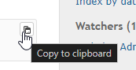

# Preブロックの内容をクリップボードにコピーするボタンを追加する
## 説明
Preブロックの内容をクリップボードにコピーするボタンをPreブロックに追加します．  

## イメージ


## 設定
- パスのパターン:
- 挿入位置: 全ページのヘッダ
- 種別: HTML

## コード
```HTML
<!--
// Path pattern:
// Insertion position: Head of all pages
// Type:               HTML
// Comment:            Adding a copy button to the pre block
-->
<script type="text/javascript">
  //<![CDATA[
  $(() => {
    const resourcesAll = {
      en: {
        labelButtonDefault: "Copy to clipboard",
        labelButtonCopied: "Copied!",
      },
      ja: {
        labelButtonDefault: "クリップボードにコピー",
        labelButtonCopied: "コピーされました!",
      },
    };
    const resources =
      resourcesAll[document.documentElement.lang] || resourcesAll["en"];

    const $copyButton = $("<button>")
      .addClass("pre-copy-button ui-icon ui-icon-copy")
      .attr("title", resources.labelButtonDefault)
      .on("click", function (e) {
        const $pre = $(this).parents("pre");
        if ($pre.length > 0) {
          $pre.attr("data-clipboard-text", $pre.text());
          copyTextToClipboard($pre[0]);
          $(this).attr("title", resources.labelButtonCopied);
          setTimeout(() => {
            $pre.removeAttr("data-clipboard-text");
            $(this).attr("title", resources.labelButtonDefault);
          }, 500);
        }
      });

    $("pre").each((i, e) => {
      if ($(e).find("code")) {
        $(e).append($copyButton.clone(true));
      }
    });
  });
  //]]>
</script>
<style>
  pre:has(.pre-copy-button) {
    position: relative;

    &:hover .pre-copy-button {
      display: block;
      opacity: 0.3;
    }
  }
  .pre-copy-button {
    position: absolute;
    top: 0;
    right: 0;
    margin: 3px;
    width: 18px;
    height: 18px;
    cursor: pointer;
    display: none;

    &:hover {
      opacity: 1 !important;
    }

    &:active {
      background-color: #DDD;
    }
  }
</style>
```