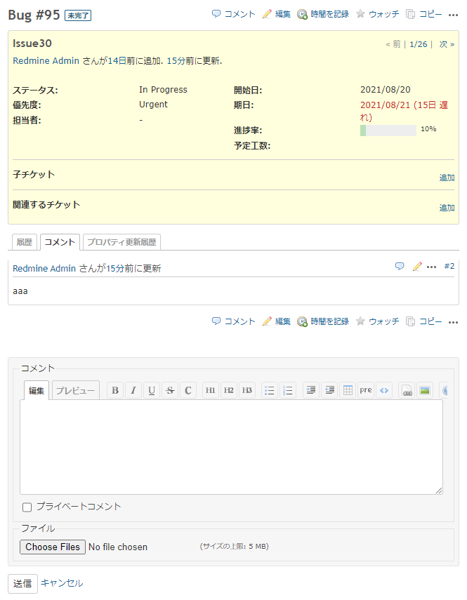

# チケット編集時にコメント入力欄のみを表示する
## 説明
チケット編集時にコメント入力欄のみを表示するボタンを追加します．  
標準の編集ボタンをクリックすると標準の編集画面に戻ります．

## イメージ


## 動作確認環境
- Redmine
  - 4.2.2
- ブラウザ
  - IE11
  - Chrome
  - Edge

## 設定
- パスのパターン: /issues/[0-9]+
- 種別: HTML

## コード
```HTML
<script>
    //<![CDATA[
    window.addEventListener('DOMContentLoaded', function () {
        function addClassNameCommentOnly(state) {
            if (state) {
                $('#update').addClass('comment-only');
            } else {
                $('#update').removeClass('comment-only');
            }
        }

        // issue actions
        $('#content div.contextual>a.icon-edit').each(function (_, elem) {
            var $menu_edit = $(elem)
                .click(function () {
                    addClassNameCommentOnly(false);
                });

            var $menu_comment = $menu_edit.clone()
                .removeClass('icon-edit')
                .addClass('icon-comment')
                .click(function () {
                    addClassNameCommentOnly(true);
                });

            $menu_edit.parent().prepend($menu_comment.text('コメント'));
        });

        // journal actions
        $('#history .journal-actions>a.icon-comment').each(function (_, elem) {
            $(elem).click(function (e) {
                if (!$('#update').is(':visible')) {
                    addClassNameCommentOnly(!e.ctrlKey);
                }
            })
            .attr('title', '引用（Ctrl+: ＋編集）');
        });
    });
    //]]>
</script>

<style>
    #update.comment-only > h3 {
        visibility:hidden;
    }
    #update.comment-only div.box fieldset.tabular {
        display: none;
    }
</style>
```
