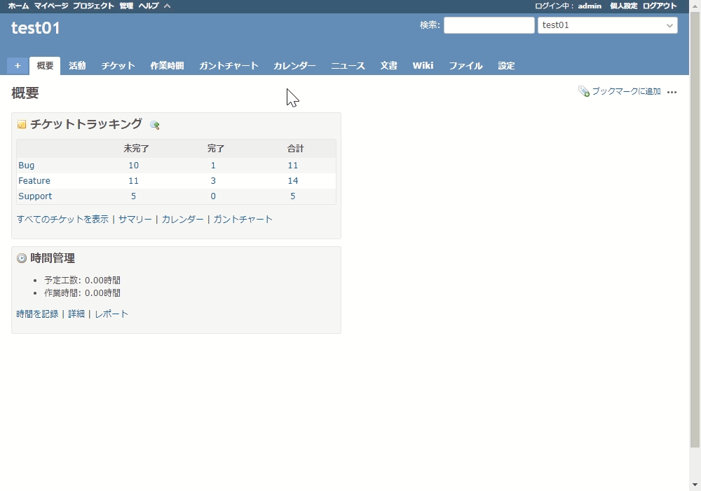

# ヘッダーの表示・非表示を切り替え可能にする
## 説明
ヘッダーの表示・非表示を切り替え可能にするボタンをトップメニューに追加します．  
非表示時はトップメニューを上部に固定します．また，ボタンにマウスカーソルを
載せるだけで一時的にヘッダーを表示することが可能になります．  

## イメージ


## 動作確認環境
- Redmine
  - 3.4.13
  - 4.2.2
- ブラウザ
  - IE11
  - Chrome
  - Edge
  - Vivaldi

## 設定
- パスのパターン: 
- 種別: HTML

## コード
```HTML
<script>
    //<![CDATA[
    window.addEventListener('DOMContentLoaded', function () {

        // ----- elements -----
        var $header = $('#header');
        var $topMenu = $('#top-menu');
        var $main = $('#header + div');

        // ----- default settings -----
        var defaultTopMenuEdgeWidth = $topMenu.outerWidth() - $topMenu.width();
        var defaultHeaderEdgeWidth = $header.outerWidth() - $header.width();
        var emptyStyle = {
            'position': '',
            'width': '',
            'z-index': '',
            'top': '',
            'box-sizing': '',
        }
        var pathSubDir = (function(){
            try {
                var pathKey = '/plugin_assets/view_customize/';
                var path = $('head>link[href*="' + pathKey + '"]')[0].href;
                var pathSubDir = path.slice(
                    path.indexOf(location.host) + location.host.length,
                    path.indexOf(pathKey));
                if (pathSubDir == '/') pathSubDir = '';
                return pathSubDir;
            } catch (error) {
                return '';
            }
        }());

        // ----- add button -----
        var $btn = $('<a id="hide_header_btn" />').css({
            'cursor': 'pointer',
            'background-image': 'url(' + pathSubDir + '/images/arrow_down.png)',
            'padding-left': '16px',
            'height': '16px',
        }).attr('class', 'icon icon-only');
        $('#top-menu>ul').append($('<li />').append($btn));


        // ----- functions -----
        function setCookie(name, value, exdays) {
            var date = new Date();
            date.setTime(date.getTime() + (exdays * 24 * 60 * 60 * 1000));
            var expires = 'expires=' + date.toUTCString();
            var path = pathSubDir;
            if (path.length == 0) path = '/';
            document.cookie = name + '=' +value + ';' + expires + ';' +
                'path=' + path;
        }

        function getCookie(name) {
            var cookies = decodeURIComponent(document.cookie).split(';');
            for (var i = 0; i < cookies.length; i++) {
                var cookie = cookies[i].trim();
                if (cookie.indexOf(name + '=') == 0) {
                    return cookie.substring(name.length + 1, cookie.length);
                }
            }
            return '';
        }

        var hideHeader = function (state) {
            floatHeader(false);
            $header.removeClass('floating');

            if (state) {
                $header.hide();
                $btn.attr('title', 'ヘッダーを表示');
                $btn.css({'transform': ''});
            } else {
                $header.show();
                $btn.attr('title', 'ヘッダーを非表示');
                $btn.css({'transform': 'scaleY(-1)'});
            }
            floatTopmenu(state);
            setCookie('hide_header', state, 30);
        }

        var floatHeader = function (state) {
            if (state) {
                if (!$header.hasClass('floating') && !$header.is(':visible')) {
                    $header.css({
                        'position': 'fixed',
                        'width': 'calc(100% - ' + defaultHeaderEdgeWidth + 'px)',
                        'z-index': 100,
                        'top': $topMenu.outerHeight(),
                        'box-sizing': 'content-box',
                    });
                    $header.addClass('floating');
                    $header.show();
                }
            } else {
                if ($header.hasClass('floating')) {
                    $header.hide();
                    $header.css(emptyStyle);
                    $header.removeClass('floating');
                }
            }
        }

        var floatTopmenu = function (state) {
            if (state) {
                $topMenu.css({
                    'position': 'fixed',
                    'width': 'calc(100% - ' + defaultTopMenuEdgeWidth + 'px)',
                    'z-index': 101,
                    'top': 0,
                    'box-sizing': 'content-box',
                });
                $main.css({
                    'margin-top': $topMenu.outerHeight() +
                    parseInt($main.css('margin-top')),
                });
            } else {
                $topMenu.css(emptyStyle);
                $main.css({
                    'top': '',
                    'position': '',
                    'margin-top': '',
                });
            }
        }

        // set events
        $btn.click(function () {
            hideHeader(
                $header.is(':visible') && !$header.hasClass('floating')
            );
        });
        $btn.mouseover(function () {
            floatHeader(true);
        });
        $header.mouseleave(function () {
            floatHeader(false);
        });

        // initial invoke
        hideHeader(getCookie('hide_header') == 'true');
    });
    //]]>
</script>

<style>
    /* Show headers in mobile environment */
    @media screen and (max-width:899px) {
        #header {
            display: block !important;
        }

        #hide_header_btn {
            display: none;
        }

        #main {
            padding-top: 64px !important;
        }
    }

    /* Initial state of the header */
    #header {
        display: none;
    }
</style>
```
