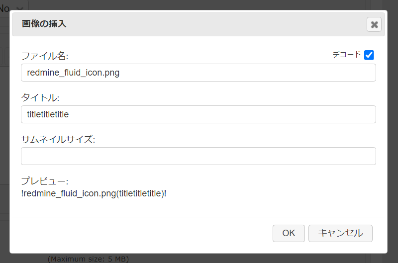
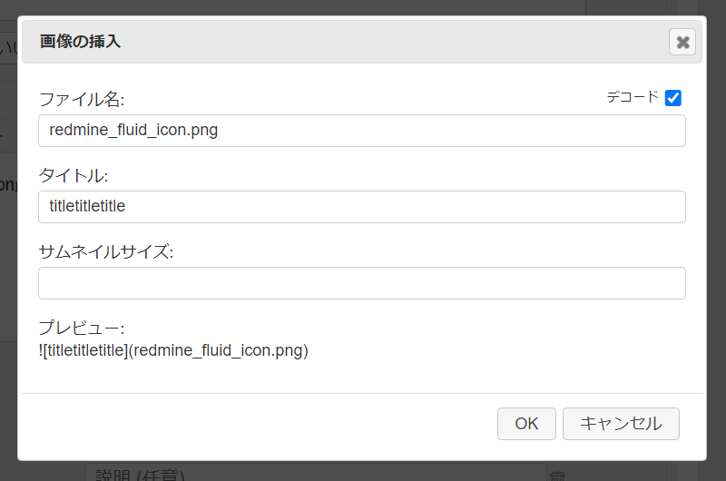
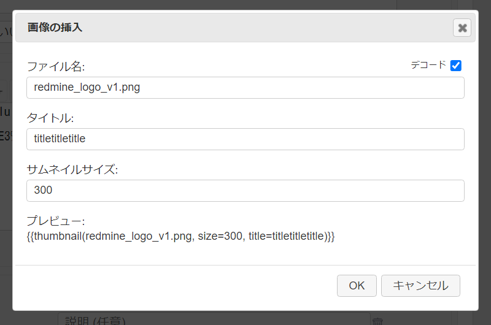
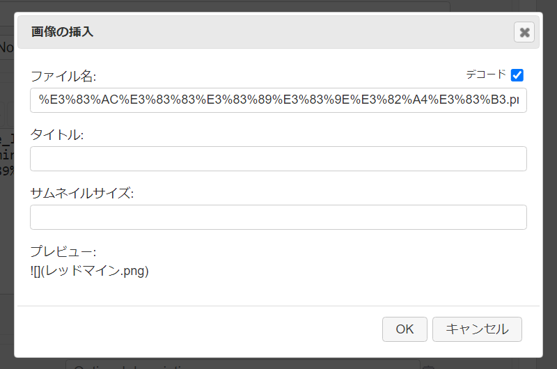
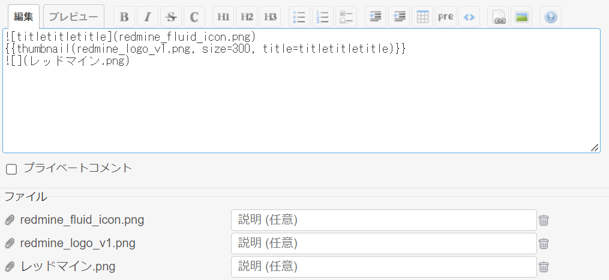

# 画像挿入ダイアログ
## 説明
wiki の画像ボタンの動作を画像挿入ダイアログに置き換えます．  
wiki への画像ファイルのドラッグ＆ドロップ時にも動作します．  
サムネイルサイズを指定した場合はサムネイルマクロを挿入し，
それ以外は Textile または Markdown タグを挿入します．


## 動作確認済環境
### Redmine
- 5.0.3
### ブラウザ
- Chrome 107.0.5304.88
- Vivaldi 5.5.2805.42
- Edge 107.0.1418.26
- FireFox 106.0.2

## イメージ
### 1. Textile タグの挿入（Textile 書式設定時）

### 2. Markdown タグの挿入（Markdown or CommonMark Markdown 書式設定時）

### 3. サムネイルマクロの挿入（サムネイルサイズ入力時）

### 4. 日本語ファイル名のデコードに対応


### 5. 出力例


## View Customize plugin 設定
- パスのパターン: 
- 種別: HTML

## コード
```HTML
<script type="text/javascript">
//<![CDATA[
(function () {
    const labelModalTitle = '画像の挿入';
    const labelModalFilename = 'ファイル名:';
    const labelModalImageTitle = 'タイトル:';
    const labelModalThumbnailSize = 'サムネイルサイズ:';
    const labelModalDecode = 'デコード';
    const labelModalTagPreview = 'プレビュー:';
    const labelModalOk = 'OK';
    const labelModalCancel = 'キャンセル';
    const labelUploadingMessage = 'アップロード中...';
    const heightModal = 'auto';
    const widthModal = 500;
    const checkedDecodeDefault = true;

    let activeJsToolBar;

    let dialog;
    let initializeComplete = false;

    let selectedTexts = [];
    let taskStarted = false;

    class SelectedText {
        constructor(textarea) {
            let prefix = '';
            let suffix = '';
            let start = 0;
            let end = 0;
            let scrollTop = 0;
            let text = '';

            if (typeof (textarea["setSelectionRange"]) != undefined) {
                start = textarea.selectionStart;
                end = textarea.selectionEnd;
                scrollTop = textarea.scrollTop;
                text = textarea.value.substring(start, end);
                let beforeLast = textarea.value.substr(start - 1, 1);
                let afterFirst = textarea.value.substr(end, 1);

                prefix = (start != 0 && beforeLast.match(/\S/)) ? ' ' : '';
                suffix = (afterFirst.match(/\S/)) ? ' ' : '';
            }

            this.prefix = prefix;
            this.suffix = suffix;
            this.start = start;
            this.end = end;
            this.scrollTop = scrollTop;
            this.text = text;
        }
    }

    function initImageModal() {
        if (typeof jsToolBar === 'undefined') return false;
        if (typeof jsToolBar.prototype.elements['img'] === 'undefined') {
            return false;
        }

        // replace function
        jsToolBar.prototype.elements['img']['fn']['wiki'] = function () {
            activeJsToolBar = this;
            addTask();
        }

        initializeComplete = true;
        return true;
    }

    function mutationCallback(mutationList, observer) {
        mutationList.forEach((mutation) => {
            if (mutation.type == 'childList') {
                if (initImageModal()) {
                    observer.disconnect();
                }
            }
        });
    }

    let observer = new MutationObserver(mutationCallback);
    observer.observe(
        document.querySelector('head'), {
        childList: true,
        attributes: false,
        subtree: false
    });

    function showUploadingMessagge(show = false) {
        let $jstEditor = $(activeJsToolBar.editor);
        if ($jstEditor.length == 0) return;

        $(activeJsToolBar.textarea).prop('disabled', show);

        if (show) {
            $jstEditor.css('position', 'relative');
            let $uploadingMessage =
                $('<div>' + labelUploadingMessage + '</div>')
                    .addClass('uploading-message')
                    .css({
                        'position': 'absolute',
                        'top': '50%',
                        'left': '50%',
                        'transform': 'translate(-50%, -50%)',
                    });
            $jstEditor.prepend($uploadingMessage);
        } else {
            $jstEditor.css('position', '');
            $jstEditor.find('.uploading-message').remove();
        }
    }

    function splitMultilineText(textarea, selectedText) {
        let textSplitted = selectedText.text.split('\n');
        let start = selectedText.start;
        let selectedTextsTemp = [];

        let s = start;
        for (let i = 0; i < textSplitted.length; i++) {
            let t = textSplitted[i];
            if (i == textSplitted.length - 1 && t.trim() == '') break;
            let e = s + t.length;

            // select a portion of the selected texts
            textarea.setSelectionRange(s, e);
            selectedTextsTemp.push(new SelectedText(textarea));
            s = e + 1;
        }

        return selectedTextsTemp;
    }

    function executeTask() {
        if (taskStarted) return;
        if (selectedTexts.length === 0) return;

        if (ajaxUpload.uploading > 0) {
            showUploadingMessagge(true);

            // If any files are being uploaded, recheck after 300ms.
            setTimeout(executeTask, 300);

            return;
        }

        showUploadingMessagge(false);

        taskStarted = true;
        dialog.dialog('open');
    }

    function addTask() {
        let textarea = activeJsToolBar.textarea;
        let selectedText = new SelectedText(textarea);

        if (selectedText.text.trim().indexOf('\n') > 0) {
            let selectedSplittedTexts =
                splitMultilineText(textarea, selectedText);
            selectedSplittedTexts.forEach((selectedSplittedText) =>
                selectedTexts.push(selectedSplittedText));
        }
        else {
            selectedTexts.push(selectedText);
        }

        // Move cursor to end of string
        textarea.focus();
        textarea.setSelectionRange(
            selectedText.end, selectedText.end);

        if (!taskStarted) {
            setTimeout(executeTask);
        }
    }

    function clearSelectedTexts() {
        selectedTexts = [];
        taskStarted = false;
    }

    $(function () {
        if (!initializeComplete) {
            // If initialization is not completed, abort the process.
            observer.disconnect();
            return;
        }

        let isCancelled = true;
        let selectedText;
        let attachmentNames = [];
        const textFormatting =
            ($("head>script[src*='/jstoolbar/textile.js']").length > 0) ?
                'textile' : 'markdown';

        // generate modal
        const $modal = $('<div />')
            .attr('id', 'insert-image-modal')
            .attr('title', labelModalTitle);

        const $modalFilename = $('<input />')
            .attr('id', 'insert-image-modal_filename')
            .attr('type', 'text');

        const $modalImageTitle = $('<input />')
            .attr('id', 'insert-image-modal_title')
            .attr('type', 'text');

        const $modalThumbSize = $('<input />')
            .attr('id', 'insert-image-modal_size')
            .attr('type', 'number')
            .attr('min', 0);

        const $modalTagPreview = $('<span />')
            .attr('id', 'insert-image-modal_tag-preview');

        const $modalDecode = $('<input />')
            .attr('id', 'insert-image-modal_decode')
            .attr('type', 'checkbox')
            .prop('checked', checkedDecodeDefault);

        const $modalDecodeBox = $('<span />')
            .attr('id', 'insert-image-modal_decode_box')
            .append($('<label />')
                .attr('for', 'insert-image-modal_decode')
                .append(labelModalDecode))
            .append($modalDecode);

        [$modalFilename, $modalImageTitle, $modalThumbSize, $modalDecode]
            .map((obj) => {
                obj.keydown((e) => {
                    let key = e.which;
                    if (key == 13) {
                        isCancelled = false;
                        dialog.dialog('close');
                        return false;
                    } else {
                        setTimeout(previewFormattedText, 100);
                    }
                });

                obj.focusout(() => {
                    setTimeout(previewFormattedText, 100);
                });
                obj.click(() => {
                    setTimeout(previewFormattedText, 100);
                });
            });

        $modal
            .append(
                $('<p></p>')
                    .append(labelModalFilename)
                    .append($modalFilename)
                    .append($modalDecodeBox))
            .append(
                $('<p></p>')
                    .append(labelModalImageTitle)
                    .append($modalImageTitle))
            .append(
                $('<p></p>')
                    .append(labelModalThumbnailSize)
                    .append($modalThumbSize))
            .append(
                $('<p></p>')
                    .append(labelModalTagPreview)
                    .append('<br>')
                    .append($modalTagPreview));

        function generateDecorator(
            tagFormatting, thumbnailSize, imageTitle) {
            let prefix = '';
            let suffix = '';
            switch (tagFormatting) {
                case 'thumbnail':
                    prefix = '{{thumbnail(';
                    suffix =
                        ((thumbnailSize === '') ? '' :
                            ', size=' + thumbnailSize) +
                        ((imageTitle === '') ? '' :
                            ', title=' + imageTitle) +
                        ')}}';
                    break;
                case 'textile':
                    prefix = '!';
                    suffix =
                        ((imageTitle === '') ?
                            '' : '(' + imageTitle + ')') +
                        '!';
                    break;
                case 'markdown':
                    prefix = '';
                    break;
            }

            return [prefix, suffix];
        }

        function formatText(text, tagFormatting) {
            var formattedText = text;
            if ($modalDecode.prop('checked')) {
                formattedText = decodeURIComponent(text);
                if (tagFormatting !== 'thumbnail') {
                    formattedText = formattedText
                        .replaceAll(' ', encodeURIComponent(' '));
                }
            }
            return formattedText;
        }

        function previewFormattedText() {
            let tagFormatting = ($modalThumbSize.val() == '') ?
                textFormatting : 'thumbnail';
            let [prefix, suffix] = generateDecorator(
                tagFormatting,
                $modalThumbSize.val(),
                $modalImageTitle.val());
            $modalTagPreview.text(
                prefix +
                formatText($modalFilename.val(), tagFormatting) +
                suffix);
        }

        function resetForm() {
            $modalFilename.val('');
            $modalThumbSize.val('');
            $modalImageTitle.val('');
            $modalTagPreview.text('');
        }

        function setAutocompleteItems() {
            attachmentNames = [];
            let $atags = $(
                '#add_attachments input.filename, ' +
                '#existing-attachments input.filename, ' +
                '#new-attachments input.filename'
            );
            $atags.each((i, elem) => {
                let value = $(elem).val();
                if (attachmentNames.indexOf(value) < 0) {
                    attachmentNames.push(value);
                }
            });
        }

        dialog = $modal.dialog({
            autoOpen: false,
            height: heightModal,
            width: widthModal,
            modal: true,
            buttons: [{
                text: labelModalOk,
                click: () => {
                    isCancelled = false;
                    dialog.dialog('close');
                }
            },
            {
                text: labelModalCancel,
                click: () => dialog.dialog('close')
            }
            ],
            open: () => {
                isCancelled = true;
                setAutocompleteItems();
                $modalFilename.autocomplete({
                    source: attachmentNames,
                    select: () => {
                        setTimeout(previewFormattedText, 100);
                    }
                });

                resetForm();

                if (selectedTexts.length > 0) {
                    selectedText = selectedTexts[0];
                } else {
                    selectedText =
                        new SelectedText(activeJsToolBar.textarea);
                }

                $modalFilename.val(selectedText.text);
                previewFormattedText();
            },
            close: () => {
                if (isCancelled) {
                    clearSelectedTexts();
                    return;
                }
                let textarea = activeJsToolBar.textarea;
                let tagFormatting = ($modalThumbSize.val() == '') ?
                    textFormatting : 'thumbnail';
                let [prefix, suffix] = generateDecorator(
                    tagFormatting, $modalThumbSize.val(),
                    $modalImageTitle.val());
                let formattedText =
                    selectedText.prefix +
                    prefix +
                    formatText($modalFilename.val(), tagFormatting) +
                    suffix +
                    selectedText.suffix;

                // place formatted text
                textarea.focus();
                textarea.value =
                    textarea.value.substring(0, selectedText.start) +
                    formattedText +
                    textarea.value.substring(selectedText.end);

                textarea.scrollTop = selectedText.scrollTop;

                if (selectedTexts.length <= 1 &&
                    $modalFilename.val() == '') {
                    // move cursor
                    let cursorPos =
                        selectedText.start + selectedText.prefix.length +
                        prefix.length;
                    textarea.setSelectionRange(cursorPos, cursorPos);
                    clearSelectedTexts();
                    return;
                } else {
                    if (selectedTexts.length > 0) {
                        // remove the first item
                        selectedTexts.shift();

                        let shift =
                            formattedText.length - selectedText.text.length;

                        // shift
                        for (let i = 0; i < selectedTexts.length; i++) {
                            selectedTexts[i].start += shift;
                            selectedTexts[i].end += shift;
                        }

                        taskStarted = false;
                        if (selectedTexts.length > 0) {
                            setTimeout(executeTask);
                        }
                    }
                }
            }
        });
    });
}());
//]]>
</script>
<style>
#insert-image-modal>p {
    position: relative;
}

#insert-image-modal input:not([type=checkbox]) {
    width: 100%;
}

#insert-image-modal_tag-preview {
    width: 100%;
    word-break: break-all;
    color: aaa;
}

#insert-image-modal_decode {
    height: auto;
}

#insert-image-modal_decode_box {
    position: absolute;
    right: 0;
    top: 0;
    font-size: 80%;
}

div.ui-dialog[aria-describedby=insert-image-modal] div.ui-dialog-buttonpane button.ui-button {
    height: auto;
    line-height: 1em;
}
</style>
```
