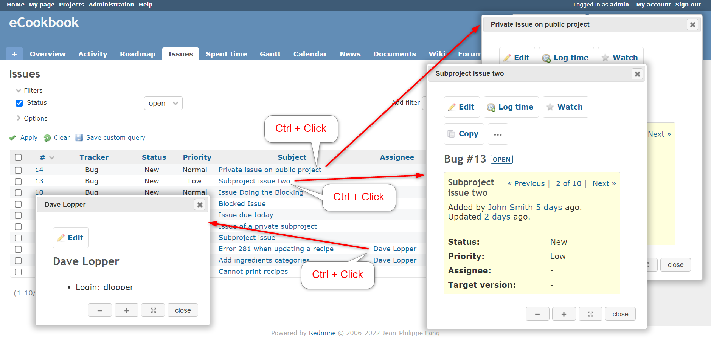

# どこでもポップアップ
## 説明
Ctrl + Click で内部リンクの内容をポップアップウィンドウ内に表示します．

## イメージ


## 動作確認環境
- Redmine
  - 5.0.2
- ブラウザ
  - Chrome
  - Edge
  - Vivaldi

## 設定
- パスのパターン: 
- 種別: HTML

## コード
```HTML
<script>
    //<![CDATA[
    $(function () {
        // ----- settings start -----
        const REDMINE_URL = window.location.origin + $('#top-menu a.home').attr('href');
        let popup_width_global = 1000;
        let popup_height_global = 600;

        // target anchor tags in the content
        // let target_anchor_tags = $('#content a:not(a[data-method]):not(a[onclick])');

        // target anchor tags in the content except thumbnails
        let target_anchor_tags = $('#content a:not(a[data-method]):not(a[onclick]):not(.thumbnail)');

        // objects not displayed in popup
        let hide_targets = '#top-menu, #header, #footer, #sidebar';

        // support redmine_theme_farend_bleuclair
        hide_targets += ', #sidebar-switch-panel';

        // default is popup mode
        let modal_mode = false;

        // localization
        var label_close = 'close';
        var label_reload = 'reload';
        var label_expand_width = 'expand width';
        var label_reduce_width = 'reduce width';
        var label_collapse_expand = 'collapse/expand';
        var message_external_link_is_not_supported = 'External link is not supported.';

        if (document.documentElement.lang === 'ja') {
            var label_close = '閉じる';
            var label_reload = '再読み込み';
            var label_expand_width = '横幅を拡張';
            var label_reduce_width = '横幅を縮小';
            var label_collapse_expand = '縮小/拡大';
            var message_external_link_is_not_supported = '外部リンクはポップアップ表示非対応です。';
        }
        // ----- settings end -----


        let get_abs_url = function (url) {
            var a = document.createElement('a');
            a.href = url;
            return a.href;
        };

        let open_popup = function (title, href) {
            let updateAfterClose = false;
            let popup_container = $('<div title="' + title + '"></div>').addClass(
                'popup-anywhere-container');
            let dialog;
            let popup_height = popup_height_global;
            let popup_width = popup_width_global;
            let contents_updated = false;
            let min_width = 0;
            let min_height = 0;

            let is_collapsed = function () {
                if (typeof dialog === 'undefined') {
                    return false;
                }
                let current_width = dialog.dialog('option', 'width');
                let current_height = dialog.dialog('option', 'height');
                return current_width <= min_width && current_height <= min_height;
            }

            let generate_buttons = function () {
                let buttons = [];
                if (!is_collapsed()) {
                    buttons = buttons.concat(
                        [{
                                title: label_reduce_width,
                                icon: 'ui-icon-minus',
                                click: function () {
                                    let current_width = dialog.dialog('option', 'width');
                                    popup_width = current_width / 2;
                                    popup_width_global = popup_width;
                                    dialog.dialog('option', 'width', popup_width);
                                }
                            },
                            {
                                title: label_expand_width,
                                icon: 'ui-icon-plus',
                                click: function () {
                                    let current_width = dialog.dialog('option', 'width');
                                    popup_width = current_width * 2;
                                    margin_width = 30;
                                    if (popup_width > window.innerWidth - margin_width) {
                                        popup_width = window.innerWidth - margin_width;
                                    }
                                    popup_width_global = popup_width;
                                    dialog.dialog('option', 'width', popup_width);
                                }
                            }
                        ]);
                }

                return buttons.concat(
                    [{
                            title: label_collapse_expand,
                            icon: 'ui-icon-arrow-4-diag',
                            click: function () {
                                if (is_collapsed()) {
                                    dialog.dialog('option', 'height', popup_height);
                                    dialog.dialog('option', 'width', popup_width);
                                    dialog.dialog('option', 'buttons', generate_buttons());
                                } else {
                                    dialog.dialog('option', 'height', 0);
                                    dialog.dialog('option', 'width', 0);
                                    setTimeout(function () {
                                        let current_width = dialog.dialog('option',
                                            'width');
                                        let current_height = dialog.dialog('option',
                                            'height');
                                        min_width = current_width;
                                        min_height = current_height;
                                        dialog.dialog('option', 'buttons',
                                            generate_buttons());
                                    });
                                }
                            }
                        },
                        {
                            text: contents_updated ? label_reload : label_close,
                            click: function () {
                                updateAfterClose = contents_updated;
                                dialog.dialog('close');
                            }
                        }
                    ])
            };

            dialog = popup_container.dialog({
                dialogClass: 'popup-anywhere-dialog',
                closeText: label_close,
                autoOpen: false,
                height: popup_height,
                width: popup_width,
                modal: modal_mode,
                buttons: generate_buttons(),
                open: function () {
                    popup_container.empty();
                    let iframe = $('<iframe src="' + href + '"></iframe>');
                    iframe.addClass('popup-anywhere-content');
                    iframe.hide();

                    let editStyle = function () {
                        let iframeContents = iframe.contents();
                        iframeContents.find('#main').css({
                            'cssText': 'padding: 0 !important;'
                        });
                        iframeContents.find(
                            hide_targets
                        ).css({
                            'cssText': 'display: none !important;'
                        });
                    };

                    iframe.on('load', function () {
                        editStyle();
                        // hide the window to prevent flickering
                        $(iframe.contents()[0].defaultView).on('beforeunload',
                            function () {
                                iframe.hide();
                            });
                        $(iframe.contents()[0].defaultView).on('submit',
                            function () {
                                contents_updated = true;
                            });
                        iframe.show();
                        dialog.dialog('option', 'buttons', generate_buttons());
                    });
                    popup_container.prepend(iframe);
                },
                close: function () {
                    popup_container.empty();
                    if (updateAfterClose) {
                        location.reload();
                    }
                },
                resizeStop: function () {
                    popup_height = dialog.dialog('option', 'height');
                    popup_height_global = popup_height;
                    popup_width = dialog.dialog('option', 'width');
                    popup_width_global = popup_width;
                    dialog.dialog('option', 'buttons', generate_buttons());
                }
            });

            dialog.dialog('open');
        };

        // replace the click events on the target anchor tags
        target_anchor_tags.unbind('click');
        target_anchor_tags.on('click', function (e) {
            if (e.ctrlKey) {
                let title = $(this).text();
                let href = $(this).attr('href');
                let is_internal_url = (new RegExp('^' + REDMINE_URL)).test(get_abs_url(href));
                if (is_internal_url) {
                    open_popup(title, href);
                    return false;
                } else {
                    alert(message_external_link_is_not_supported);
                }
            }
        });
    });
    //]]>
</script>

<style type="text/css">
    .popup-anywhere-container {
        display: flex;
        overflow: hidden !important;
    }

    .popup-anywhere-content {
        flex-grow: 1;
        border: none;
        margin: 0;
        padding: 0;
    }

    .popup-anywhere-dialog {
        box-shadow: 0px 0px 10px 5px rgb(0 0 0 / 25%);
    }
</style>
```