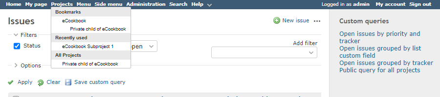
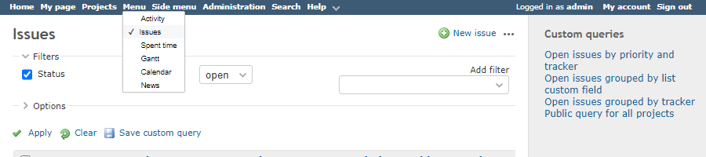
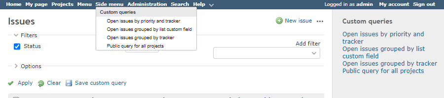
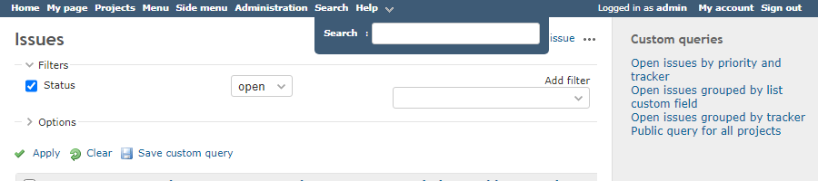
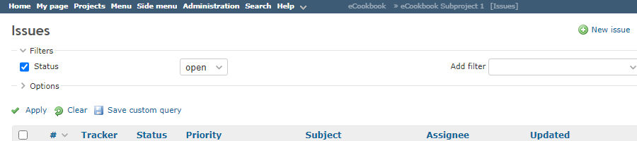

# シンプルメニューバー

## 説明

- Redmine のトップメニューにヘッダーおよびサイドバーの一部の機能を集約
- ヘッダーの表示/非表示はトップメニューに追加されたボタンのマウスオーバー/クリックで切替可能
- [ヘッダーの表示・非表示を切り替え可能にする](../hide_header/hide_header.md) をベースにしています

## 動作確認済環境

### Redmine

- 5.0.4

### ブラウザ

- Chrome 108.0.5359.125
- Vivaldi 5.6.2867.50
- Edge 108.0.1462.54
- Firefox 108.0.1

## イメージ

### 1. プロジェクト一覧メニュー



### 2. プロジェクトメニュー（ヘッダーの項目）



### 3. サイドメニュー（サイドバーの項目の一部）



### 4. 検索フォーム



### 5. パンくずリスト（画面の横幅が一定以上ある場合にトップメニューの中央に表示）



## View Customize plugin 設定

- パスのパターン:
- 挿入位置: 全ページのヘッダ
- 種別: HTML

## コード

```html
<script>
  //<![CDATA[

  // If the saved visibility setting is false, apply the following style that hides the header.
  // Then remove this style after the DOM has finished loading.
  if (localStorage.getItem("header-visibility") === "false") {
    $("head").append(
      '<style class="simple-menu-bar">#header{display: none;}</style>'
    );
  }

  window.addEventListener("DOMContentLoaded", () => {
    // ----- i18n -----
    const lang = document.documentElement.lang;
    const resources = {
      menu: "Menu",
      sideMenu: "Side menu",
      showHeader: "Show Header",
      hideHeader: "Hide Header",
      search: "Search",
    };

    if (lang === "ja") {
      resources.menu = "メニュー";
      resources.sideMenu = "サイドメニュー";
      resources.showHeader = "ヘッダーを表示";
      resources.hideHeader = "ヘッダーを非表示";
      resources.search = "検索";
    }

    // ----- Define variables -----
    const $header = $("#header");
    const $topMenu = $("#top-menu");
    const $mainMenu = $("#main-menu");
    const $main = $("#main");
    const $projectsMenu = $topMenu.find("ul li a.projects:first");
    const $helpMenu = $topMenu.find("ul li a.help:first");
    const $sideBar = $("#sidebar");

    const defaultTopMenuHeight = $topMenu.outerHeight();
    const defaultHeaderHeight = $header.outerHeight();
    const homePath = $topMenu.find("ul li a.home:first").attr("href");
    const projectIdentifier = $("body")
      .attr("class")
      .split(" ")
      .filter((i) => i.match(/^project-/))[0]
      ?.match(/^project-(.+)/)[1];
    const syncHeaderVisibilityItems = [];

    if ($topMenu.has('a.administration').length > 0) {
      $topMenu.addClass('has-admin-menu');
    }

    // ----- Common functions -----
    // Show or hide dropdown menu
    function setDropdownVisibility(dropdown, state) {
      if (state) {
        if ($header.css("visibility") != "hidden") return;
        dropdown.addClass("visible");
      } else {
        dropdown.removeClass("visible");
      }
    }

    // Set menu items for simple menu
    function setMenuItems($menu, $menuItems, $baseMenu, syncHeader = true) {
      if ($menuItems.length === 0) return;

      // Customize menu
      $menu
        .addClass("simple-menu")
        .css("cursor", "pointer")
        .mouseover(() => {
          setDropdownVisibility($menuItems, true);
        });

      // Insert menu in top menu
      if ($topMenu.has($menu).length === 0) {
        $("<li />").append($menu).insertAfter($baseMenu);
      }

      // Insert menu items into menu
      $menuItems
        .addClass("menu-children")
        .insertAfter($menu)
        .parent()
        .mouseleave(() => {
          setDropdownVisibility($menuItems, false);
        });

      //Enable Jquery UI menu widget
      $menuItems.menu();

      // Visibility settings
      if (syncHeader) {
        syncHeaderVisibilityItems.push($menu);
        if ($header.css("visibility") === "hidden") $menu.show();
      } else {
        $menu.show();
      }
    }

    // ----- Create menu functions -----
    function createSimpleMenu() {
      if ($projectsMenu.length === 0) return;

      const $simpleMenu = $("<a />")
        .attr("id", "simple-menu")
        .text(resources.menu);

      function formatSimpleMenuItems($simpleMenuItems) {
        if ($simpleMenuItems.length === 0) return $simpleMenuItems;

        $simpleMenuItems
          .find("li .new-object")
          .attr("onclick", "return false")
          .removeAttr("id");

        $simpleMenuItems.find("a.projects").parent().remove();

        return $simpleMenuItems;
      }

      const $simpleMenuItems = $mainMenu.children("ul").clone();
      if ($simpleMenuItems.length === 0) {
        // Load main menu items from projects page in the background
        var url = $projectsMenu.attr("href");
        $.get(url).done((data) => {
          const $simpleMenuItems = $("#main-menu > ul", $(data));
          setMenuItems(
            $simpleMenu,
            formatSimpleMenuItems($simpleMenuItems),
            $projectsMenu.parent()
          );
        });
      } else {
        setMenuItems(
          $simpleMenu,
          formatSimpleMenuItems($simpleMenuItems),
          $projectsMenu.parent()
        );
      }
    }

    function createSimpleSideMenu() {
      if ($sideBar.children().length === 0) return;
      if (location.pathname.match(/my\/account$/)) return;

      let $baseMenu = $("#simple-menu").parent();
      if ($baseMenu.length === 0) $baseMenu = $projectsMenu.parent();
      if ($baseMenu.length === 0) return;

      let $simpleSideMenu;
      const useAdminMenu = $("#admin-menu").length > 0;
      if (useAdminMenu) {
        $simpleSideMenu = $topMenu.find("a.administration:first");
      } else {
        $simpleSideMenu = $("<a />").text(resources.sideMenu);
      }
      $simpleSideMenu.attr("id", "simple-side-menu");

      const $simpleSideMenuItems = $("<ul />");

      function appendMenuItemHeader(text) {
        const lastItemIsContextual = $simpleSideMenuItems
          .children(":last")
          .hasClass("contextual");

        $simpleSideMenuItems.append(
          $("<li><div>" + text + "</div></li>").addClass("ui-widget-header")
        );

        if (lastItemIsContextual) {
          const previousItem = $simpleSideMenuItems.children().eq(-2);
          $simpleSideMenuItems.append(previousItem);
        }
      }

      function appendMenuItems(_, elem) {
        const $elem = $(elem);
        const $nodeName = $elem.prop("nodeName");

        if ($nodeName === "H3" || $nodeName === "H4") {
          appendMenuItemHeader($elem.text());
        } else if ($nodeName === "FORM") {
          // Form is not supported
        } else if ($nodeName === "DIV") {
          if ($elem.hasClass("contextual_")) {
            $simpleSideMenuItems.append(
              $("<li />")
                .append($elem.children().clone())
                .addClass("contextual")
            );
          } else if ($elem.attr("id") === "watchers") {
            appendMenuItems(null, $elem.children("h3"));
            appendMenuItems(null, $elem.children("div.contextual"));
            appendMenuItems(null, $elem.children("ul"));
          } else if ($elem.hasClass("tags-cloud")) {
            // RedmineUP Tags Plugin Items
            $elem.find("a").each(appendMenuItems);
          } else if ($elem.hasClass("tags")) {
            // Redmine Tags Plugin Items
            $elem.find("a").each(appendMenuItems);
          } else if ($elem.attr("id") === "admin-menu") {
            $elem.find("li").each((_, elem2) => {
              $simpleSideMenuItems.append(
                $(elem2).clone().addClass("admin-menu")
              );
            });
          } else {
            $elem.children().each(appendMenuItems);
          }
        } else if ($nodeName === "UL") {
          $simpleSideMenuItems.append($elem.children().clone());
        } else if ($nodeName === "P") {
          if ($elem.children("a").attr("id") === "toggle-completed-versions") {
            // Completed versions on roadmap page
            appendMenuItemHeader($elem.text());
          } else {
            $elem.children().each(appendMenuItems);
          }
        } else if ($simpleSideMenuItems.children().length === 0) {
        } else if ($nodeName === "LI") {
          $simpleSideMenuItems.append($elem.clone());
        } else {
          $simpleSideMenuItems.append(
            $("<li />").append($elem.clone().removeAttr("title"))
          );
        }
      }

      // Create menu item from side bar content
      if (
        projectIdentifier &&
        location.pathname.match(`/${projectIdentifier}/wiki`)
      ) {
        appendMenuItemHeader("Wiki Sidebar");
      }
      $sideBar.children().each(appendMenuItems);
      if ($simpleSideMenuItems.children().length === 0) return;

      setMenuItems(
        $simpleSideMenu,
        $simpleSideMenuItems,
        $baseMenu,
        !useAdminMenu
      );
    }

    function createSimpleProjectsMenu() {
      const $projectMenu = $topMenu
        .find("ul > li > a.projects:first")
        .attr("id", "simple-projects-menu");
      if ($projectMenu.length === 0) return;

      const $projectJumpContents = $("#project-jump.drdn div.drdn-content");
      const $simpleProjectMenuItems = $("<ul />");

      // Clone project jump content
      $projectJumpContents
        .children("div.drdn-items.projects")
        .children()
        .each((_, elem) => {
          $elem = $(elem);
          const isHeader = $elem.prop("nodeName") === "STRONG";
          if (isHeader) {
            $simpleProjectMenuItems.append(
              $("<li><div>" + $elem.text() + "</div></li>").addClass(
                "ui-widget-header"
              )
            );
          } else {
            $simpleProjectMenuItems.append(
              $("<li />").append($elem.clone().removeAttr("title"))
            );
          }
        });

      setMenuItems($projectMenu, $simpleProjectMenuItems, null, false);
    }

    function createSimpleSearchForm() {
      const $simpleSearchMenu = $("<a />")
        .attr("id", "simple-search-menu")
        .css("cursor", "pointer")
        .addClass("simple-menu")
        .text(resources.search);

      const $simpleSearchForm = $("#quick-search>form").clone();
      if ($simpleSearchForm.length === 0) return;
      $simpleSearchForm.find("input.q").removeAttr("id");

      const $simpleSearchDialog = $("<div />").append($simpleSearchForm);

      let $baseMenu = $helpMenu.parent();
      if ($baseMenu.length > 0) {
        $("<li />").append($simpleSearchMenu).insertBefore($baseMenu);
      } else {
        $topMenu
          .children("ul:first")
          .append($("<li />").append($simpleSearchMenu));
      }

      $simpleSearchDialog
        .css("background-color", $topMenu.css("background-color"))
        .addClass("menu-children")
        .insertAfter($simpleSearchMenu);

      $simpleSearchMenu.click(() => {
        setDropdownVisibility(
          $simpleSearchDialog,
          !$simpleSearchDialog.hasClass("visible")
        );
      });

      // Close form when clicked outside this form
      $(document).click((e) => {
        if ($simpleSearchMenu.parent().has(e.target).length === 0) {
          setDropdownVisibility($simpleSearchDialog, false);
        }
      });

      syncHeaderVisibilityItems.push($simpleSearchMenu);
    }

    function createSimpleTitleBar() {
      const $projectTitle = $header.children("h1:first");

      var $titleBar = $("<div />").addClass("simple-title-bar");
      var $title = $("<div />");
      $titleBar.append($title);

      if ($projectTitle.children().length > 0) {
        $title.append($projectTitle.children().clone());
      } else {
        $title.append($projectTitle.text());
      }

      var mainMenu = $mainMenu.find(".selected:first").clone().css("margin", 0);
      if (mainMenu.length === 1) {
        $title.append(
          $("<span />")
            .addClass("main-menu")
            .append("<span> [</span>")
            .append(mainMenu)
            .append("<span>]</span>")
        );
      }

      $title.attr("title", $titleBar.text());
      $topMenu.prepend($titleBar);
    }

    // ----- Toggle header visibility function -----
    function enableHeaderVisibilityToggleFeature() {
      const emptyStyle = {
        position: "",
        width: "",
        height: "",
        zIndex: "",
        top: "",
        boxSizing: "",
      };

      const $btn = $("<a />")
        .attr("id", "hide-header-btn")
        .css({
          cursor: "pointer",
          backgroundImage: "url(" + homePath + "images/arrow_down.png)",
          paddingLeft: "16px",
          height: "16px",
        })
        .addClass("icon icon-only");
      $topMenu.children("ul").append($("<li />").append($btn));

      function setHeaderVisibility(state) {
        setHeaderPositionFixed(false);
        $header.removeClass("fixed");
        if (state) {
          $header.css({
            visibility: "visible",
            padding: "",
            height: "",
            minHeight: "",
          });
          $btn
            .attr("title", resources.hideHeader)
            .css({ transform: "scaleY(-1)" });

          syncHeaderVisibilityItems.forEach((e) => {
            e.hide();
          });
        } else {
          $header.css({
            visibility: "hidden",
            padding: 0,
            height: 0,
            minHeight: 0,
          });
          $btn.attr("title", resources.showHeader).css({ transform: "" });

          syncHeaderVisibilityItems.forEach((e) => {
            e.show();
          });
        }
        setTopMenuPositionFixed(!state);
        localStorage.setItem("header-visibility", state);
      }

      function setHeaderPositionFixed(state) {
        if (state) {
          if (
            !$header.hasClass("fixed") &&
            $header.css("visibility") === "hidden"
          ) {
            $header
              .css({
                position: "fixed",
                zIndex: 200,
                top: defaultTopMenuHeight,
                width: "100%",
                boxSizing: "border-box",
                visibility: "visible",
                padding: "",
                height: defaultHeaderHeight,
                minHeight: "",
              })
              .addClass("fixed");
          }
        } else {
          if ($header.hasClass("fixed")) {
            $header
              .css(emptyStyle)
              .css({
                visibility: "hidden",
                padding: 0,
                height: 0,
                minHeight: 0,
              })
              .removeClass("fixed");
          }
        }
      }

      function setTopMenuPositionFixed(state) {
        if (state) {
          $topMenu
            .css({
              position: "fixed",
              zIndex: 101,
              top: 0,
              width: "100%",
              boxSizing: "border-box",
              height: defaultTopMenuHeight,
            })
            .addClass("fixed");
          $main.css({
            marginTop: defaultTopMenuHeight,
          });
        } else {
          $topMenu.css(emptyStyle).removeClass("fixed");
          $main.css({
            top: "",
            position: "",
            marginTop: "",
          });
        }
      }

      $btn
        .click(() => {
          setHeaderVisibility(
            localStorage.getItem("header-visibility") === "false" ||
              $header.hasClass("fixed")
          );
        })
        .mouseover(() => {
          setHeaderPositionFixed(true);
        });
      $header.mouseleave(() => {
        setHeaderPositionFixed(false);
      });

      // Load settings from local storage
      if (localStorage.getItem("header-visibility") === "false") {
        setHeaderVisibility(false);
      }
    }

    // Invoke each functions
    try {
      createSimpleMenu();
      createSimpleSideMenu();
      createSimpleProjectsMenu();
      createSimpleSearchForm();
      createSimpleTitleBar();
      enableHeaderVisibilityToggleFeature();
    } finally {
      // Remove the default header style if the style is added to the html header
      $("head>style.simple-menu-bar").remove();
    }
  });

  // ----- Global function -----
  // Offset scroll position to prevent them from being hidden by the top menu
  function simpleMenuBarOffsetScrollPosition() {
    const hash = window.location.hash;
    if (hash) {
      const anchor = document.querySelector(hash);
      if (anchor) {
        const top = $(anchor).offset().top;
        const offset = window.screen.availWidth < 900 ? 65 : 20;
        setTimeout(() => {
          window.scrollTo(0, top - offset);
        });
      }
    }
  }

  window.addEventListener("load", simpleMenuBarOffsetScrollPosition);
  window.addEventListener("hashchange", simpleMenuBarOffsetScrollPosition);
  //]]>
</script>

<style>
  /* ----- Simple menu settings ----- */
  #top-menu .simple-menu:not(#simple-projects-menu) {
    /* initial state is hidden */
    display: none;
  }

  #top-menu .simple-menu + .ui-menu {
    color: black;
    display: none;
    box-shadow: 0px 0px 3px rgba(0, 0, 0, 0.1);
  }

  #simple-side-menu + .ui-menu,
  #simple-projects-menu + .ui-menu {
    max-height: calc(100vh - 100px);
    overflow-y: auto;
    overflow-x: hidden;
  }

  #top-menu .simple-menu + ul.ui-menu.visible {
    position: absolute;
    display: block;
  }

  #top-menu .simple-menu + .ui-menu li {
    float: left;
    clear: both;
    width: 100%;
  }

  #top-menu .simple-menu + .ui-menu li a,
  #top-menu .simple-menu + .ui-menu li div {
    color: black;
    width: 100%;
    margin: 0;
    box-sizing: border-box;
    display: inline-block;
    text-decoration: none;
    font-weight: normal;
    border-width: 0;
  }

  #top-menu .simple-menu + .ui-menu li.ui-widget-header {
    border: 0;
  }

  #top-menu .simple-menu + .ui-menu li.ui-widget-header div {
    font-weight: bold;
    color: #333;
  }

  #top-menu .simple-menu + .ui-menu .ui-menu-item > a:before {
    display: inline-block;
    line-height: 1em;
    width: 20px;
    height: 1em;
    font-weight: bold;
    text-align: center;
  }

  #top-menu .simple-menu + .ui-menu .ui-menu-item > a {
    padding-left: calc(20px + 2px);
  }

  #top-menu
    .simple-menu
    + .ui-menu
    .ui-menu-item:not(.admin-menu)
    > a.selected {
    padding-left: 0;
  }

  #top-menu
    .simple-menu
    + .ui-menu
    .ui-menu-item:not(.admin-menu)
    > a.selected:before {
    content: "\2713 ";
  }

  /* Support Bleuclair theme */
  body.theme-Bleuclair .icon-group:before {
    content: "\f0c0";
    font-family: Font Awesome\5 Solid;
  }

  #top-menu .simple-menu + .ui-menu a.selected {
    background-color: #f6f7f8;
  }

  #top-menu .simple-menu + .ui-menu li a.ui-state-active {
    color: #fff;
    background-color: #759fcf;
  }

  /* Show headers on mobile environment */
  @media screen and (max-width: 899px) {
    #header {
      display: block !important;
      visibility: visible !important;
      height: auto !important;
    }

    #hide-header-btn {
      display: none;
    }

    div.flyout-menu .simple-menu,
    div.flyout-menu .simple-menu + ul.ui-menu {
      display: none !important;
    }
  }

  /* ----- simple title bar settings ----- */
  #top-menu > ul {
    float: left;
  }

  #top-menu > .simple-title-bar {
    position: absolute;
    left: 0;
    pointer-events: none;
    text-align: center;
    width: 100%;
  }

  #top-menu > .simple-title-bar > div {
    display: inline-block;
    pointer-events: auto;
    opacity: 0.5;
    width: calc(100% - 550px);
    overflow: hidden;
    text-overflow: ellipsis;
    white-space: nowrap;
    direction: rtl;
    transition: opacity 1s;
  }

  
  #top-menu.has-admin-menu > .simple-title-bar > div {
    width: calc(100% - 650px);
  }

  #top-menu.fixed > .simple-title-bar > div {
    width: calc(100% - 750px);
  }

  #top-menu.fixed.has-admin-menu > .simple-title-bar > div {
    width: calc(100% - 950px);
  }

  #top-menu > .simple-title-bar > div:hover {
    opacity: 1;
  }

  #top-menu > .simple-title-bar a {
    font-weight: normal;
  }

  #top-menu > .simple-title-bar .main-menu {
    margin-left: 5px;
  }

  /* ----- simple search menu settings ----- */
  #simple-search-menu {
    /* initial state is hidden */
    display: none;
  }

  #simple-search-menu + .menu-children {
    padding: 10px;
    border-radius: 0 0 5px 5px;
    display: none;
  }

  #simple-search-menu + .menu-children.visible {
    position: absolute;
    display: block;
  }
</style>
```
