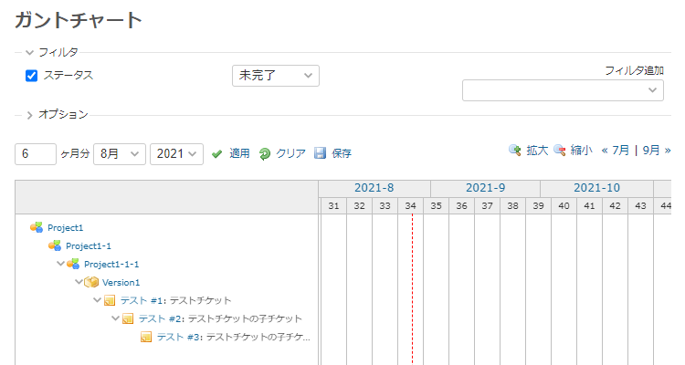
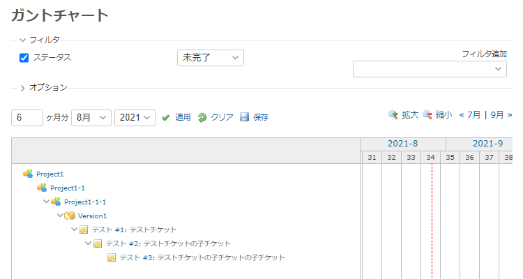

# ガントチャートの題名列の幅を変更する
## 説明
ガントチャートの題名列の幅を変更します．

## イメージ
### Before


### After


## 動作確認済み環境
- Redmine
  - 4.2.2
- ブラウザ
  - IE11
  - Chrome
  - Edge

## 設定
- パスのパターン: /issues/gantt
- 種別: JavaScript

## コード
```JavaScript
window.addEventListener('DOMContentLoaded', function () {
    // 幅を指定
    const subjectWidth = 500;

    // 題名列の幅を設定
    $('td.gantt_subjects_column').css({
        'width': subjectWidth + 'px'
    });

    $(
        'td.gantt_subjects_column .gantt_hdr, ' +
        'td.gantt_subjects_column .gantt_subjects_container'
    ).css({
        'width': (subjectWidth - 1) + 'px'
    });

    // 各チケット名の幅を設定
    $('.gantt_subjects>form>div').each(function (index) {
        var left = parseFloat($(this).css('left'));
        $(this).css('width', subjectWidth - left);
    });
});
```
