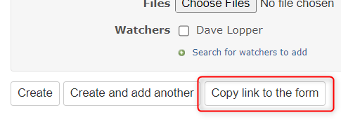

# チケット登録フォームへのリンクをクリップボードにコピーするボタンを追加する
## 説明
編集中の内容が埋め込まれた状態のチケット登録フォームへのリンクをクリップボードにコピーするボタンを追加します．  
以下の参考サイトの内容を1クリックで行います．  

参考: [Redmineワンポイントチェック(2): URLに入力値を埋め込んでチケット作成のテンプレートを実現する | Redmine.JP Blog](https://blog.redmine.jp/articles/opc/new-issue-template/)

## イメージ


## 設定
- パスのパターン: `/issues(|/new|/[0-9]+/copy)$`
- 挿入位置: 全ページのヘッダ
- 種別: JavaScript

## コード
```JavaScript
// Path pattern:       /issues(|/new|/[0-9]+/copy)$
// Insertion position: Head of all pages
// Type:               JavaScript
// Comment:            Copy link to the new form
$(() => {
  let urlBase = location.origin + location.pathname;
  if (!/\/issues(|\/new|\/[0-9]+\/copy)$/.test(urlBase)) return;
  if (/\/issues$/.test(urlBase)) urlBase += "/new";

  const $form = $("form.new_issue#issue-form");
  if ($form.length === 0) return;

  const urlDefault = new URL(urlBase + "?" + $form.serialize());
  const isCopyIssueForm = urlDefault.searchParams.has("copy_from");
  const copyFromId = urlDefault.searchParams.get("copy_from");

  const resourcesAll = {
    en: {
      label: "Copy link to the form",
      description: "Copy link to the form to the clipboard.",
      messageCopiedForNewIssue: "Link to the new ticket form has been copied.",
      messageCopiedForCopiedIssue: `Link to the copy form for the ticket #${copyFromId} has been copied.`,
    },
    ja: {
      label: "フォームへのリンクをコピー",
      description: "フォームへのリンクをクリップボードにコピーします。",
      messageCopiedForNewIssue:
        "新規チケットフォームへのリンクがコピーされました。",
      messageCopiedForCopiedIssue: `チケット#${copyFromId}のコピーフォームへのリンクがコピーされました。`,
    },
  };

  const resources =
    resourcesAll[document.documentElement.lang] || resourcesAll["en"];

  const $copyButton = $("<button>")
    .text(resources.label)
    .attr({ title: resources.description, type: "submit" })
    .on("click", function (e) {
      e.preventDefault();
      const url = new URL(urlBase + "?" + $form.serialize());
      url.searchParams.delete("utf8");
      url.searchParams.delete("authenticity_token");
      $(this).attr("data-clipboard-text", url.href);
      copyTextToClipboard(this);
      const $copiedMessage = $("<span>")
        .css({
          display: "inlineBlock",
          margin: "0 5px",
          backgroundColor: "#9fcf9f",
          padding: "2px 4px",
          borderRadius: "3px",
        })
        .text(
          isCopyIssueForm
            ? resources.messageCopiedForCopiedIssue
            : resources.messageCopiedForNewIssue
        )
        .appendTo($form);
      setTimeout(() => {
        $copiedMessage.fadeOut("slow", function () {
          $(this).remove();
        });
      }, 3000);
    })
    .appendTo($form);
});
```
