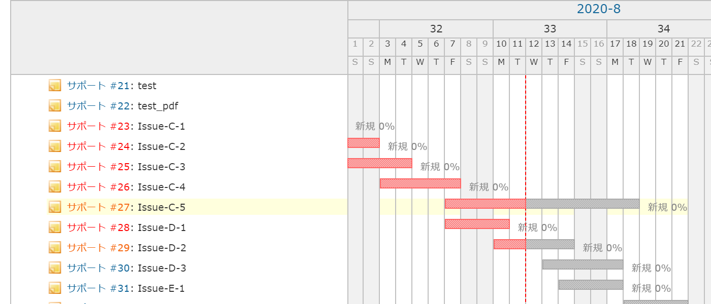

# ガントチャートのハイライトを拡張する
## 説明
チケット名にマウスオーバーした際に表示されるハイライトをガントチャート上まで拡張します．  
ガントチャートおよび進捗にマウスオーバーした際にはチケット名がハイライトされます．  

## イメージ
### Before


### After


## 動作確認
- Redmine
  - 4.1.1
- ブラウザ
  - IE11
  - Chrome

## 設定
- パスのパターン: /gantt
- 種別: JavaScript

## コード
```JavaScript
$(function() {
    // 設定
    // config
    var highlight_color = '#ffffdd';
    var highlight_height = $($('div.gantt_subjects div.issue-subject')[0]).css('height');

    // ガントチャートをハイライトするための要素を追加
    // add gantt_highlight element
    $('#gantt_area').prepend('<div id="gantt_highlight"></div>');
    $('#gantt_highlight').css({
        position: 'absolute',
        display: 'none',
        top: 0,
        left: 0,
        width: $('#gantt_area>div.gantt_hdr:first').css('width'),
        height: highlight_height,
        backgroundColor: highlight_color
    });

    // ガントチャートをハイライトするための関数を定義
    // define update highlight function for gantt_highlight
    var update_gantt_highlight_position = function(elem){
        try {
            $('#gantt_highlight').show();
            $('#gantt_highlight').css('top', $(elem).css('top'));
        } catch(err) {
            $('#gantt_highlight').hide();
        }
    }

    // チケット名をハイライトするための関数を定義
    // define update highlight function for issue-subject
    var update_gantt_highlight_subject = function(issue_id, color){
        try {
            $('#' + issue_id).css('background-color', color);
        } catch(err) {
            $('div.gantt_subjects div.issue-subject').css('background-color', '');
        }
    }

    // チャートエリアのマウスオーバーイベントを処理
    // define hover event function for gantt-area-object
    var hover_gantt_area_object = function(elem, color){
        var issue_id = $(elem).attr('data-collapse-expand');
        if (issue_id.indexOf('issue-')>-1) {
            update_gantt_highlight_subject(issue_id, color);
            if (color === '') {
                $('#gantt_highlight').hide();
            } else {
                update_gantt_highlight_position(elem);
            }
        } else {
            $('#gantt_highlight').hide();
            $('div.gantt_subjects div.issue-subject').css('background-color', '');
        }
    }

    // チケット項目名にマウスオーバーイベントを追加
    // set hover event for gantt-issue-subject
    $('div.gantt_subjects div.issue-subject').hover(function(){
        update_gantt_highlight_position(this);
    }, function(){  // unhover
        $('#gantt_highlight').hide();
    });

    // ガントチャートにマウスオーバーイベントを追加
    // set hover event for gantt-tooltip
    $('#gantt_area div.tooltip').hover(function(){
        hover_gantt_area_object(this, highlight_color);
    }, function(){  // unhover
        hover_gantt_area_object(this, '');
    });

    // ガントチャート進捗にマウスオーバーイベントを追加
    // set hover event for gantt-task
    $('#gantt_area div.task').css('z-index', 1);
    $('#gantt_area div.task').hover(function(){
        hover_gantt_area_object(this, highlight_color);
    }, function(){  // unhover
        hover_gantt_area_object(this, '');
    });
});
```
