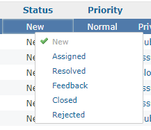
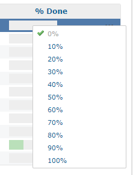
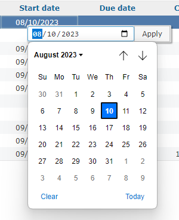
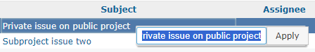

# チケット一覧のフィールド毎に編集メニューを表示する
## 説明
チケット一覧のフィールド毎にコンパクトな編集メニューを表示します．

### 対応するフィールド
- ステータス
- トラッカー
- 優先度
- 対象バージョン
- 担当者
- カテゴリ
- 進捗度
- 題名
- 開始日
- 期日
- カスタムフィールド
  - リスト型
  - キー・バリューリスト型
  - バージョン型
  - ユーザー型
  - 真偽値型
  - テキスト型
  - リンク型
  - 整数型
  - 小数型
  - 日付型

### イメージ
- 
- 
- 
- 

## 動作確認環境
- Redmine
  - 5.0.5
- ブラウザ
  - Chrome Version 117.0.5938.89 (Official Build) (64-bit)
  - Vivaldi 6.2.3105.48 (Stable channel) (64-bit)
  - Firefox 117.0.1 (64-bit)

## 設定
- パスのパターン: `/issues((|/)$|/\?.+)`
- 挿入位置: 全ページのヘッダ
- 種別: JavaScript

## コード
```JavaScript
$(() => {
  const $issueListTable = $("table.list.issues");
  if ($issueListTable.length === 0) return;

  const supportedFields = [
    "status",
    "tracker",
    "priority",
    "fixed_version",
    "assigned_to",
    "category",
    "done_ratio",
    "list",
    "enumeration",
    "version",
    "user",
    "bool",
    "subject",
    "string",
    "link",
    "int",
    "float",
    "start_date",
    "due_date",
    "date",
  ];

  // Add style to head tag
  $("head").append(
    $("<style>").text(
      "table.list.issues>tbody>tr.issue>td.selected " +
        "{box-shadow: inset #ffd 0px 0px 3px 0px;}"
    )
  );

  function generateUrl(key, value) {
    const $form = $issueListTable.parents("form");
    const backUrl = $form.find("input[name=back_url]").val();
    const $selectedIssueIds = $form.find('input[name="ids[]"]:checked');
    const issueIdsParams = $selectedIssueIds.serialize();

    if (issueIdsParams === "") return "";

    const homeAddress = $("#top-menu .home").attr("href") || "/";
    const actionOrIssueId =
      $selectedIssueIds.length > 1 ? "bulk_update" : $selectedIssueIds.val();
    const isCustomField = key.startsWith("cf_");
    const cfId = isCustomField ? key.split("_")[1] : null;

    return (
      `${homeAddress}issues/${actionOrIssueId}?` +
      `back_url=${encodeURIComponent(backUrl)}&` +
      (actionOrIssueId === "bulk_update" ? `${issueIdsParams}&` : "") +
      encodeURI(
        isCustomField
          ? `issue[custom_field_values[${cfId}]]=`
          : `issue[${key}]=`
      ) +
      encodeURIComponent(value)
    );
  }

  const $contextInput =
    $("#context-input").length > 0
      ? $("#context-input")
      : (function createContextInput() {
          function setApplyButton() {
            const $contextInput = $("#context-input");
            if ($contextInput.length === 0) return;

            const field = $contextInput.data("field");
            const value = $contextInput.children("input").val();
            const url = generateUrl(
              field.includes("cf_")
                ? field.split(" ").filter((i) => i.startsWith("cf_"))[0]
                : field,
              value
            );
            return $contextInput
              .children("a")
              .attr("href", url === "" ? "#" : url);
          }

          const $input = $("<input>")
            .css({ flexGrow: 1, height: "auto" })
            .on("click context", (event) => {
              event.stopImmediatePropagation();
            })
            .on("keypress", (event) => {
              if (event.which === 13) {
                const $applyButton = setApplyButton();
                if ($applyButton) $applyButton[0].click();
              }
            });

          const applyLabel =
            $("#query_form_with_buttons p.buttons a.icon-checked").text() ||
            "apply";

          const $applyButton = $("<a>")
            .addClass("ui-button")
            .attr({ rel: "nofollow", "data-method": "patch" })
            .css({ cursor: "pointer" })
            .on("click", setApplyButton)
            .text(applyLabel);

          const $container = $("<div>")
            .attr("id", "context-input")
            .css({
              position: "absolute",
              display: "flex",
              flexDirection: "row",
              backgroundColor: "#ddd",
              padding: "1px",
              borderRadius: "2px",
              boxShadow: "#0005 2px 2px 2px",
              width: "240px",
            })
            .append($input)
            .append($applyButton)
            .hide()
            .resizable({ handles: "e", minWidth: 240 })
            .appendTo("#content");

          $(document).on("mousedown contextmenu", (event) => {
            // Note:
            //   The click and mouseup events are not suitable here.
            //   Because mouse pointer may not be over the input field after
            //   the selecting string.
            if (!$(event.target).parents("#context-input").length) {
              $container.hide();
              $("table.list.issues>tbody>tr.issue>td.selected").removeClass(
                "selected"
              );
            }
          });

          return $container;
        })();

  // Override the `contextMenuShow` function
  if (typeof contextMenuShowOrg === "undefined") {
    contextMenuShowOrg = contextMenuShow;
  }
  contextMenuShow = function (event) {
    const targetClass = $(event.target).closest("tr.issue>td").attr("class");
    const availableFields = targetClass
      ? targetClass
          .split(" ")
          .filter((i) => supportedFields.includes(i) || i.startsWith("cf_"))
      : [];
    const isCustomField = availableFields.some((i) => i.startsWith("cf_"));
    const isSupported = availableFields.length > isCustomField ? 1 : 0;

    if (isSupported && !(event.ctrlKey || event.metaKey)) {
      fieldMenuShow(event, targetClass);
    } else {
      contextMenuShowOrg(event);
    }
  };

  function fieldMenuShow(event, field) {
    // Hide the original context menu
    $("#context-menu").hide();

    $(event.target).closest("tr.issue>td").addClass("selected");

    const typeLabel = $(
      `table.list.issues th.${field.replace(" ", ".")}>a`
    ).text();
    const currentText = $(event.target).text();

    if (
      ["date", "subject", "string", "link", "int", "float"].some((i) =>
        field.includes(i)
      )
    ) {
      const inputType = field.includes("date")
        ? "date"
        : field.includes("int") || field.includes("float")
        ? "number"
        : "text";
      const inputStep = field.includes("int")
        ? 1
        : field.includes("float")
        ? 0.01
        : "";

      $contextInput
        .css({ left: event.pageX, top: event.pageY })
        .data("field", field)
        .find("input")
        .attr({ type: inputType, step: inputStep })
        .val(
          inputType === "date" && currentText
            ? new Date(currentText).toLocaleDateString("sv-SE")
            : currentText
        );

      $contextInput.show().find("input").focus().select();
    } else {
      const url = $issueListTable.parents("form").data("cm-url");
      if (url == null) return;

      $.ajax({
        url: url,
        data: $issueListTable.parents("form").serialize(),
        success: (data) => {
          const $fieldMenu = $(data)
            .find(`li.folder>a:contains(${typeLabel})`)
            .parent()
            .children("ul");

          if ($fieldMenu.length > 0) {
            $("#context-menu")
              .css({ left: event.pageX, top: event.pageY })
              .html($fieldMenu)
              .show();
          } else {
            // Show original context menu
            contextMenuShowOrg(event);
          }
        },
      });
    }
  }
});
```
