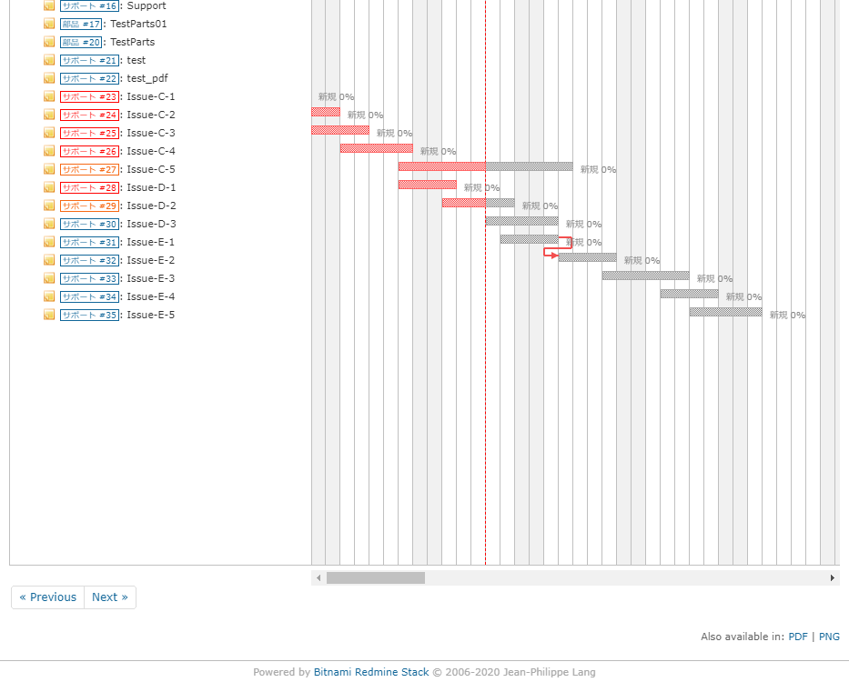
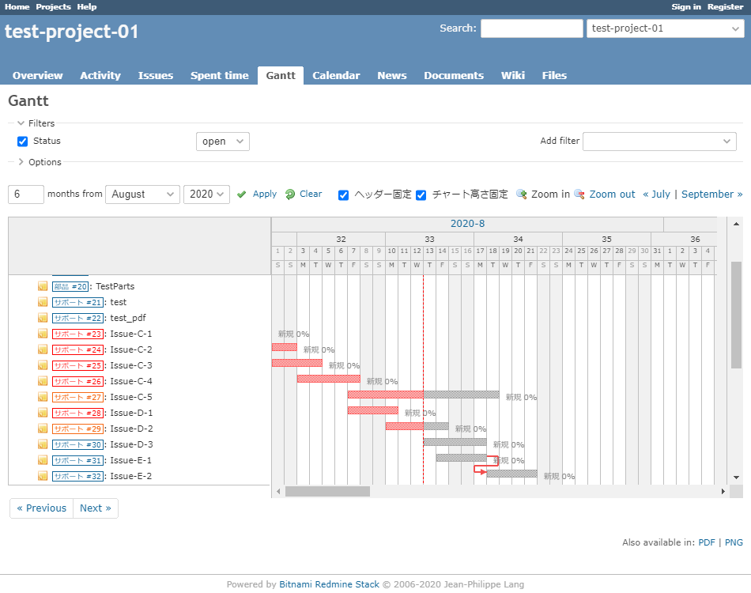

# ガントチャートの日付ヘッダーとチャート高さを固定する
## 説明
ガントチャートの表示項目が多い場合，チャートエリアが縦に長くなるため，下方にある項目の進捗を確認する際にはウィンドウを下方にスクロールすることになりますが，その際に日付ヘッダーが画面外に隠れてしまうため日付を確認することが困難になります．また，横スクロールバーも画面下部に位置しているため，横スクロールをする際には画面下部を表示する必要があり面倒です．

この問題に対処するために，JavaScript を使用することで，チャートエリアの高さを制限し，画面内に横スクロールバーを表示すると共に，スクロールした際に日付ヘッダーを画面上部に固定させる様にしました．  

尚，チャートエリアの高さ固定と日付ヘッダーの固定はチェックボックスで切り替えが可能です．  

注意点として，デザインが多少崩れます．また，IEでは横スクロール時やウィンドウサイズ変更時に動作が重たく感じられる可能性があります．  

## イメージ
### Before
例1: 項目が多いと横スクロールバーが画面外に隠れてしまう．  


例2: 横スクロールバーを表示するために画面下方にスクロールすると，日付ヘッダーが画面外に隠れてしまう．  


### After
チャート高さを制限し，日付ヘッダーを固定することで，横スクロールバーと日付ヘッダーを同時に表示出来るようになる．  


## 動作確認
- Redmine
  - 4.1.1
- ブラウザ
  - IE11
  - Chrome

## 設定
- パスのパターン: /gantt
- 種別: JavaScript

## コード
```JavaScript
$(function () {
    // 基本設定
    // settings
    var min_gantt_height = 750;
    var scrollbar_width = 17;
    var scroll_delta = 100;
    var gantt_subjects_container = $('div.gantt_subjects_container:first');
    var gantt_subjects_columns_div = $(
        'td.gantt_subjects_column>div:first-child, ' +
        'td.gantt_selected_column>div:first-child');
    var gantt_subjects_columns = $(
        'td.gantt_subjects_column, td.gantt_selected_column');
    var gantt_hdr_selected_column_name = $('.gantt_hdr_selected_column_name');
    var initial_height = $("#gantt_area").height();
    var gantt_hdr_first = $('#gantt_area>.gantt_hdr:first');

    // スタイルに関する設定
    // style settings
    gantt_subjects_container.css('overflow', 'hidden');
    gantt_subjects_columns_div.css('overflow', 'hidden');
    $('#gantt_area').parent().css({
        verticalAlign: 'top',
    });
    $('#gantt_area').css({
        borderLeft: '1px solid #c0c0c0',
        marginLeft: '1px'
    });
    gantt_subjects_container.parent().css('vertical-align', 'top');
    gantt_subjects_columns.css('vertical-align', 'top');
    
    gantt_subjects_columns_div.css('z-index', 60);
    gantt_hdr_selected_column_name.parent().css('z-index', 70);
    
    // 表示切替用のチェックボックスを追加
    // add checkbox
    $('#query_form_with_buttons>p.contextual').prepend(
        '<input type="checkbox" id="fix_header" checked>' + 
        '<label>ヘッダー固定</label>' +
        '<input type="checkbox" id="fix_gantt_height" checked>' + 
        '<label>チャート高さ固定</label>'
    )

    // チャートエリアの固定ヘッダー要素を追加
    // add fixed header
    $('#gantt_area').prepend(
        '<div id="gantt_area_header_fixed_outer">' +
        '<div id="gantt_area_header_fixed"></div></div>');
    $('#gantt_area_header_fixed').append(
        $('#gantt_area .gantt_hdr').clone(true));
    $('#gantt_area_header_fixed_outer').css({
        top: $('#gantt_area').offset().top,
        paddingLeft: 1,
        zIndex: 50,
        height: '74px',
        overflow: 'hidden',
        position: 'fixed',
        width: $('#gantt_area').css('width'),
    });

    // 土日欄が下まで延長されてしまう現象を防ぐ
    $('#gantt_area_header_fixed .gantt_hdr').filter(
        function () {return $(this).height() > 72;}).css('height', '17px');

    // チケット名欄の固定ヘッダー要素を追加
    // add fixed subjects container
    $('#content div.gantt_subjects_container').prepend(
        '<div id="gantt_subjects_container_fixed"></div>');
    $('#gantt_subjects_container_fixed').append(
        $('#content div.gantt_subjects_container .gantt_hdr:first'));
    $('#gantt_subjects_container_fixed').css({
        zIndex: 55,
    });

    // define function
    // チャートエリアの高さを設定する関数を定義
    var set_gant_area_height = function (flg_2nd_try) {
        if (typeof flg_2nd_try === 'undefined') flg_2nd_try = false;
        var window_height = $(window).height();

        // チェックボックスがオフの場合はチャート高さを初期値とする
        if (!$('#fix_gantt_height').is(':checked')) {
            $("#gantt_area").height(initial_height);
            gantt_subjects_container.height(initial_height);
            gantt_subjects_columns_div.height(initial_height);
            return
        }

        // Windowの高さが小さすぎる場合はチャート高さをWindowの高さとする
        if (window_height < min_gantt_height) {
            $("#gantt_area").height(window_height);
            gantt_subjects_container.height(window_height);
            gantt_subjects_columns_div.height(window_height);
            return
        }

        // チャート高さを画面高さに合うように調整する
        var max_height = $(document).height() - window_height;
        if (max_height <= 0) {
            if (flg_2nd_try) return
            $("#gantt_area").height(window_height);
            set_gant_area_height(true);
        } else {
            var current_height = $("#gantt_area").height();
            $("#gantt_area").height(current_height - max_height);
            gantt_subjects_container.height(
                current_height - max_height - scrollbar_width);
            gantt_subjects_columns_div.height(
                current_height - max_height - scrollbar_width);
        }
    }

    // ヘッダー固定状態とフロー状態を切り替える
    var set_state_header = function() {
        if (!$('#fix_header').is(':checked')) {
            $('#gantt_subjects_container_fixed').css({
                position: 'absolute',
                top: 0
            });
            gantt_hdr_selected_column_name.parent().css({
                position: 'absolute',
                top: 0
            });
            $('#gantt_area_header_fixed_outer').hide();
        } else {
            $('#gantt_subjects_container_fixed').css({
                position: 'fixed',
                top: $('#gantt_area').offset().top,
                width: $('#gantt_subjects_container_fixed'
                    ).parent().css('width')  // support responsive design
            });
            gantt_hdr_selected_column_name.parent().css({
                position: 'fixed',
                top: $('#gantt_area').offset().top
            });
            $(
                '#gantt_area_header_fixed_outer'
            ).width($("#gantt_area").width() - scrollbar_width);
            $('#gantt_area_header_fixed_outer').show();
        }
    }

    // チャート高さ固定状態と初期状態を切り替える
    var set_state_gantt_height = function () {
        if (!$('#fix_gantt_height').is(':checked')) {
            $('#fix_header').prop('checked', false);
            set_state_header();
            $(
                'div.gantt_subjects_container, ' + 
                'div.gantt_selected_column_container').css({
                borderBottom: ''
            });
        } else {
            $(
                'div.gantt_subjects_container, ' + 
                'div.gantt_selected_column_container').css({
                borderBottom: '1px solid #c0c0c0'
            });
        }
    }

    // 固定ヘッダーの表示設定
    var set_position_fixed = function(flg_left_only){
        if (!$('#fix_header').is(':checked')) return
        if (typeof flg_left_only === 'undefined') flg_left_only = false
        $('#gantt_area_header_fixed').offset(
            {left: gantt_hdr_first.offset().left});
        if (!flg_left_only) {
            $(
                '#gantt_subjects_container_fixed'
            ).offset({top: $("#gantt_area").offset().top});
            gantt_hdr_selected_column_name.parent().offset(
                {top: $("#gantt_area").offset().top}
            );
            $(
                '#gantt_area_header_fixed_outer'
            ).offset({top: $("#gantt_area").offset().top});
        }
    }

    // ヘッダー固定チェックボックス用クリックイベント
    $('#fix_header').on('click', function(){
        if ($(this).is(':checked') && !$('#fix_gantt_height').is(':checked')) {
            $('#fix_gantt_height').prop('checked', true);
            set_state_gantt_height();
            set_gant_area_height();
        }
        set_state_header();
        set_position_fixed();
    });

    // チャート高さ固定チェックボックス用クリックイベント
    $('#fix_gantt_height').on('click', function(){
        set_gant_area_height();
        set_state_gantt_height();
    });

    // ウィンドウスクロールイベント
    $(document).on('scroll', function() {
        set_position_fixed();
    });

    // ガントチャートエリアスクロールイベント
    var scroll_top_old = 0;
    $("#gantt_area").scroll(function () {
        var scroll_top = $('#gantt_area').scrollTop();
        if (scroll_top_old !== scroll_top) {
            gantt_subjects_container.scrollTop(scroll_top);
            gantt_subjects_columns_div.scrollTop(scroll_top);
        } else {
            set_position_fixed(flg_left_only=true);
        }
        scroll_top_old = scroll_top;
    });

    // 各オプションの幅変更イベント
    gantt_subjects_columns.on('resize', function() {
        $(
            '#gantt_subjects_container_fixed .gantt_hdr'
        ).css('width', $('.gantt_subjects_column').css('width'));
        set_state_header();
        set_position_fixed(flg_left_only=true);
    });

    // フィルター，オプション関連ボタンクリックイベント
    $(
        '#filters>legend, #options>legend, #draw_selected_columns'
    ).on('click', function() {
        window.setTimeout(function(){
            set_gant_area_height();
            set_position_fixed();
        }, 10);
    });

    // ウィンドウリサイズイベント
    $(window).resize(function() {
        set_gant_area_height();
        set_state_header();
        set_position_fixed();
    });

    // マウスホイールイベント（チャートエリア外でのスクロールを可能にする）
    // wheel event
    $(
        'td.gantt_subjects_column, ' +
        'td.gantt_project_column, ' + 
        'td.gantt_selected_column'
    ).bind('mousewheel DOMMouseScroll', function(event){
        if (event.originalEvent.wheelDelta > 0 || event.originalEvent.detail < 0) {
            // scroll up
            $('#gantt_area').scrollTop(
                $('#gantt_area').scrollTop() - scroll_delta);
        }
        else {
            // scroll down
            $('#gantt_area').scrollTop(
                $('#gantt_area').scrollTop() + scroll_delta);
        }
    });

    // hideSidebar plugin 向け設定
    $('#hideSidebarButton').on('click', function() {
        set_state_header();
    });

    // 各種関数の初回適用
    // initial invoke
    window.setTimeout(function(){
        set_state_gantt_height();
        set_gant_area_height();
        set_state_header();
        set_position_fixed();
    }, 10);
});
```
