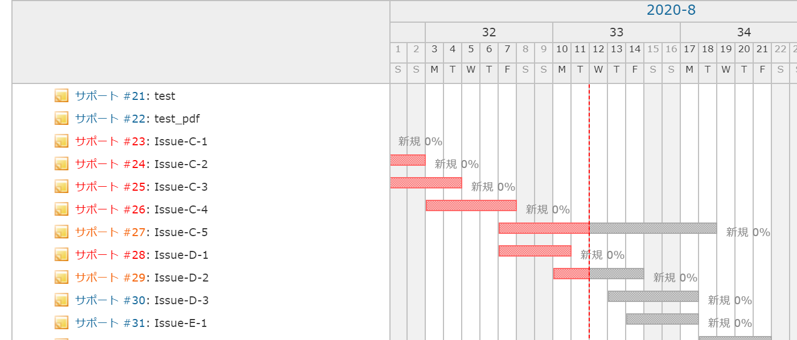

# ガントチャートの日付ヘッダーを固定する
## 説明
Redmine 初期状態では，ガントチャートの表示項目が多い場合に，画面下方にスクロールすると日付ヘッダーが隠れてしまいます．  
この JavaScript を使用することで，スクロールした際にも日付ヘッダーを画面上部に固定させることが出来ます．  


## イメージ
### Before


### After


## 設定
- パスのパターン: /gantt
- 種別: JavaScript

## コード
```JavaScript
$(function() {
    // 固定日付ヘッダーを追加
    $('#gantt_area').prepend('<div id="gantt_area_header_fixed"></div>');
    $('#gantt_area_header_fixed').append($('#gantt_area .gantt_hdr').clone(true));
    $('#gantt_area_header_fixed').css({
        top: 0,
        paddingLeft: 1,
        zIndex: 100,
        height: '74px',
        overflow: 'hidden',
    });

    // 土日欄が下まで延長されてしまう現象を防ぐ
    $('#gantt_area_header_fixed .gantt_hdr').filter(function () {return $(this).height() > 72;}).css('height', '17px');

    // 項目コンテナ部の固定ヘッダーを追加
    $('#content div.gantt_subjects_container').prepend('<div id="gantt_subjects_container_fixed"></div>');
    $('#gantt_subjects_container_fixed').append($('#content div.gantt_subjects_container .gantt_hdr:first'));
    $('#gantt_subjects_container_fixed').css({
        top: 0,
        zIndex: 101,
    });

    // オプション項目の設定
    $('.gantt_hdr_selected_column_name').parent().css('z-index', 102);
    
    // 固定ヘッダー表示時の設定
    var set_position_fixed = function(){
        var offset_left = $('#gantt_area>.gantt_hdr:first').offset().left;
        $('#gantt_area_header_fixed').show();
        $('#gantt_area_header_fixed').css({
            position: 'fixed',
            width: $('#gantt_area').width() - offset_left + $('#gantt_area').position().left
        });
        $('#gantt_subjects_container_fixed').css('position', 'fixed');
        $('.gantt_hdr_selected_column_name').parent().css('position', 'fixed');
        $('#gantt_area_header_fixed').offset({left: offset_left});
    }

    // 標準ヘッダー表示時の設定
    var set_position_absolute = function(){
        $('#gantt_area_header_fixed').hide();
        $('#gantt_area_header_fixed').css('position', 'absolute');
        $('#gantt_subjects_container_fixed').css('position', 'absolute');
        $('.gantt_hdr_selected_column_name').parent().css('position', 'absolute');
    }

    // 状態の更新
    var set_position = function() {
        if ($('table.gantt-table').offset().top < $(document).scrollTop()) {
            set_position_fixed();
        } else {
            set_position_absolute();
        }
    }

    // 縦スクロールイベント
    $(document).on('scroll', function() {
        set_position();
    });

    // 横スクロールイベント
    $('#gantt_area').on('scroll', function() {
        set_position();
    });

    // 各項目の幅変更イベント
    $('td.gantt_subjects_column, td.gantt_selected_column').on('resize', function() {
        $('#gantt_subjects_container_fixed .gantt_hdr').css('width', $('.gantt_subjects_column').css('width'));
        set_position();
    });

    // ウィンドウリサイズイベント
    $(window).resize(function() {
        set_position();
    });

    // hideSidebar プラグインをサポート
    $('#hideSidebarButton').on('click', function() {
        set_position();
    });
});
```