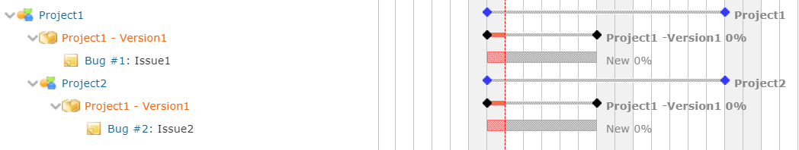
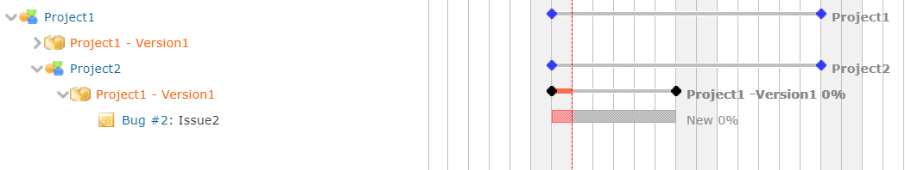
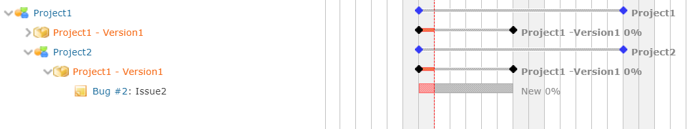

# 共有バージョン使用時のガントチャートの動作を修正
## 説明
ガントチャートで複数のプロジェクト間で共有されたバージョンが複数列に表示されていた場合に，折りたたみ機能が正常に動作しなくなる問題に対処します．

## イメージ
### 折りたたみ前

### 折りたたみ後（修正前）

### 折りたたみ後（修正後）


## 動作確認環境
- Redmine
  - 4.1.1
- ブラウザ
  - IE11
  - Chrome
  - Edge

## 設定
- パスのパターン: /issues/gantt$
- 種別: JavaScript

## コード
```JavaScript
$(function(){
    var add_project_name = function(version_name, project_id){
        return 'project-' + project_id + ';' + version_name;
    }

    // add project name for version name in column
    var project_id = 0;
    $("div.gantt_subjects>form>div.project-name, div.gantt_subjects>form>div.version-name").each(function (_, element) {
        var json = $(element).data('collapse-expand');
        if ($(element).hasClass('project-name')) {
            project_id = parseInt(json.obj_id.split('-')[1]);
        } else if (project_id > 0) {
            json.obj_id = add_project_name(json.obj_id, project_id);
            $(element).attr('daata-collapse-expand', json);
        }
    });

    // add project name for version name in gantarea
    var project_id = 0;
    $('#gantt_area form > div.project, #gantt_area form > div.version').each(function (_, element) {
        var collapse_expand = $(element).data('collapse-expand');
        if ($(element).hasClass('project')) {
            project_id = parseInt(collapse_expand.split('-')[1]);
        } else if (project_id > 0) {
            collapse_expand = add_project_name(collapse_expand, project_id);
            $(element).attr('data-collapse-expand', collapse_expand);
        }
    });
});
```
