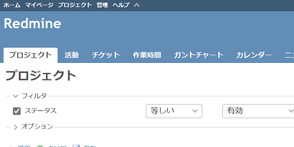
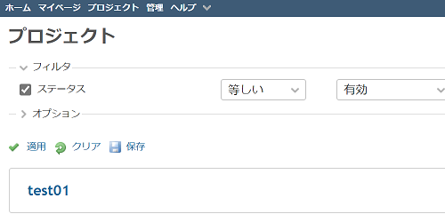

# ヘッダーの表示・非表示を切り替え可能にするボタンを追加する
## 説明
ヘッダーの表示・非表示を切り替え可能にします．モバイル環境では無効とします．

## イメージ
### 通常時

### ヘッダーを隠した場合


## 動作確認
- Redmine
  - 4.1.1
- ブラウザ
  - IE11
  - Chrome
  - Edge

## 設定
- パスのパターン: 
- 種別: JavaScript

## コード
```JavaScript
$(function () {
    // ----- add button -----
    $('#top-menu>ul').append($('<li><a id="hide_header"></a></li>'));
    
    var $btn = $('#hide_header');
    $btn.css({'cursor': 'pointer'});


    // ----- define functions -----
    // https://www.w3schools.com/js/js_cookies.asp
    function setCookie(cname, cvalue, exdays) {
        var d = new Date();
        d.setTime(d.getTime() + (exdays * 24 * 60 * 60 * 1000));
        var expires = 'expires=' + d.toUTCString();
        document.cookie = cname + '=' + cvalue + ';' + expires + ';path=/';
    }


    // https://www.w3schools.com/js/js_cookies.asp
    function getCookie(cname) {
        var name = cname + '=';
        var decodedCookie = decodeURIComponent(document.cookie);
        var ca = decodedCookie.split(';');
        for (var i = 0; i < ca.length; i++) {
            var c = ca[i];
            while (c.charAt(0) == ' ') {
                c = c.substring(1);
            }
            if (c.indexOf(name) == 0) {
                return c.substring(name.length, c.length);
            }
        }
        return '';
    }

    var hide_header = function(state){
        if (state) {
            $('#header').hide();
            $btn.attr('title', 'ヘッダーを表示');
            $btn.attr('class', 'icon icon-sorted-asc');
        } else {
            $('#header').show();
            $btn.attr('title', 'ヘッダーを非表示');
            $btn.attr('class', 'icon icon-sorted-desc');
        }
        setCookie('hide_header', state, 30);
    }

    $btn.click(function(){hide_header($('#header').is(':visible'));});
    
    // initial invoke
    hide_header(getCookie('hide_header') == 'true');

    // force the header to display on mobile
    var $style = $('<style type="text/css"></style>')
    $style.text(
        "@media screen and (max-width:899px) {" +
            "#header { display: block !important; }" +
            "#hide_header {display: none;}" +
        "}"
        );
    $('head').append($style);
});
```
