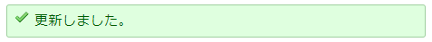
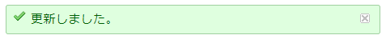

# 通知バーに閉じるボタンを追加する
## 説明
通知バーに閉じるボタンを追加します．

## イメージ
### Before


### After


## 動作確認済環境
- Redmine
  - 4.1.1
- ブラウザ
  - IE11
  - Chrome

## 設定
- パスのパターン: /*
- 種別: JavaScript

## コード
```JavaScript
$(function () {
    var $button = $('<span></span>');
    $button.css({
        width: $('#flash_notice').height(),
        height: $('#flash_notice').height(),
        padding: 0,
        display: 'inline-block',
        float: 'right'
    });
    $button.addClass('icon icon-close');
    $button.on('click', function () {
        $('#flash_notice').hide();
    });
    $button.hover(function () {
        $(this).css('cursor', 'pointer');
    });
    $('#flash_notice').append($button);
});
```
