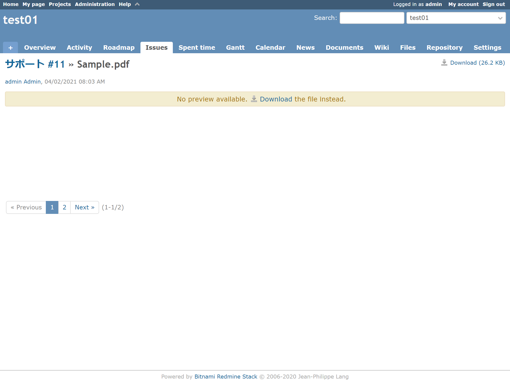
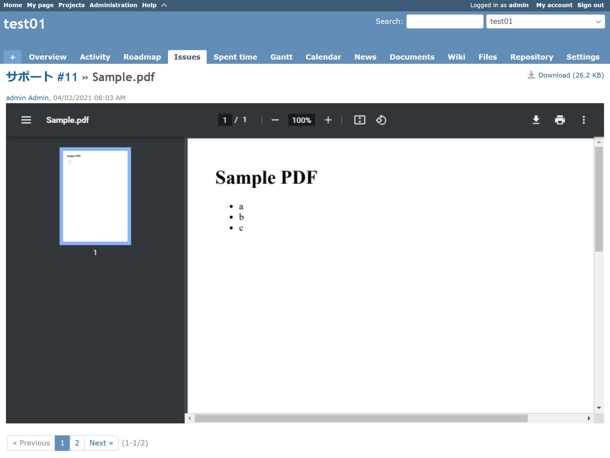
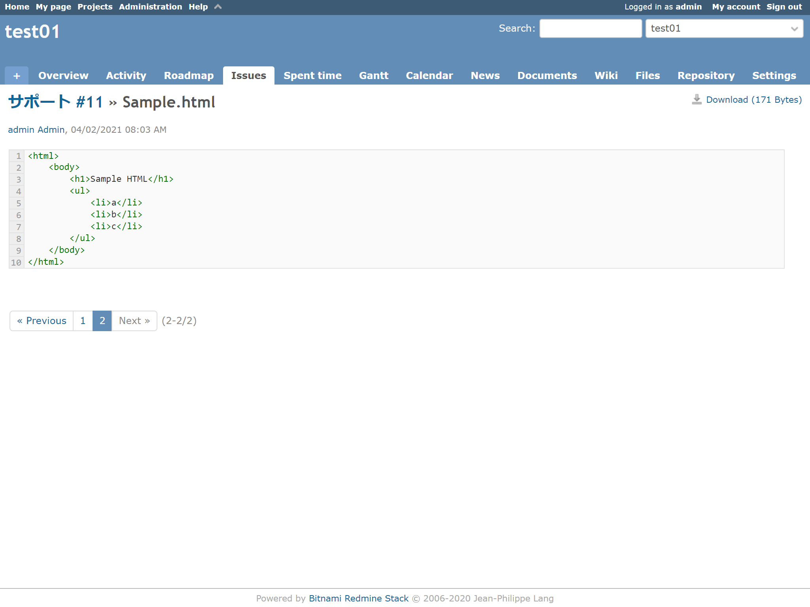
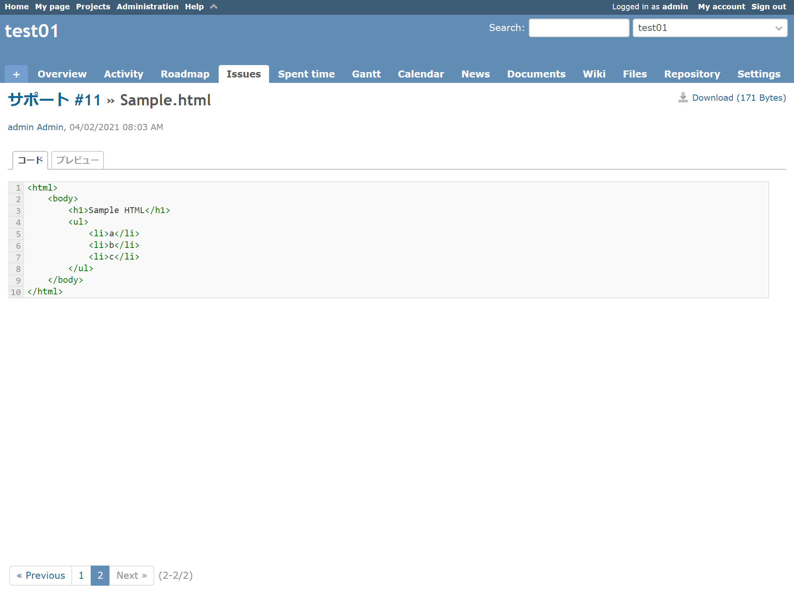
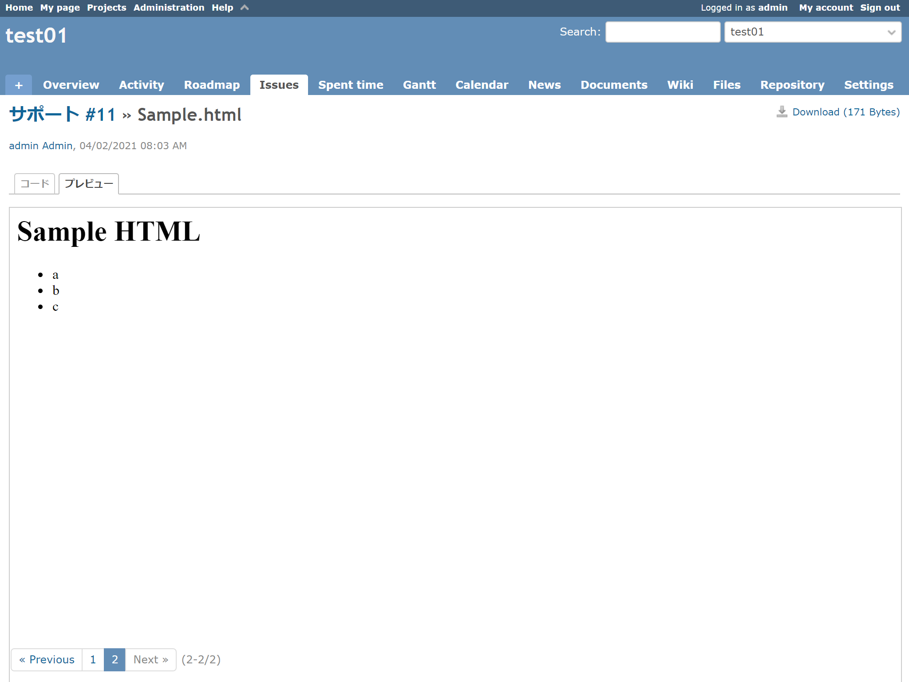

# PDFとHTMLのプレビューを有効にする
## 説明
添付ファイルのPDFとHTMLのプレビューを有効にします．

## イメージ
### PDF
#### Before


#### After


### HTML
#### Before


#### After



## 動作確認済環境
- Redmine
  - 4.1.1
- ブラウザ
  - IE11
  - Chrome

## 設定
- パスのパターン: /attachments/[0-9]+
- 種別: JavaScript

## コード
```JavaScript
$(function () {
    // --- settings ---
    const SUPPORTED_EXTENSIONS = ['pdf', 'html', 'svg'];
    const MIN_HEIGHT = '300px';
    const CODE_TITLE = 'コード';
    const PREVIEW_TITLE = 'プレビュー';

    var $filecontent_container = $('div.filecontent-container:first');


    // --- define functions ---
    function getExtensionFromPath(filepath) {
        var filepath_split = filepath.split('.');
        return filepath_split[filepath_split.length - 1];
    }


    function setFilecontentContainerHeightAnyType($target){
        $target.addClass('image');
        setFilecontentContainerHeight();
        $target.removeClass('image')
    }


    function addPdfPreviewer(pdf_filepath) {
        var $embed =
            $('<embed src="' + pdf_filepath + '" type="application/pdf" />');
        $embed.css({
            'width': '100%',
            'height': '100%',
            'min-height': MIN_HEIGHT
        });

        // remove dummy content and add new view
        $filecontent_container
            .empty()
            .append($embed);

        setFilecontentContainerHeightAnyType($embed);
    }

    function addHtmlPreviewer(html_filepath) {
        function changeView() {
            if ($('#tab-code').hasClass('selected')) {
                $('#tab-code').removeClass('selected');
                $('#tabcontent-code').hide();

                $('#tab-preview').addClass('selected');
                $('#tabcontent-preview').show();
            } else {
                $('#tab-code').addClass('selected');
                $('#tabcontent-code').show();

                $('#tab-preview').removeClass('selected');
                $('#tabcontent-preview').hide();
            }
        }

        function generateTab() {
            var $tabs = $('<div class="tabs"><ul></ul></div>');
            var $tab_item_code =
                $('<li><a id="tab-code" class="selected">' +
                    CODE_TITLE + '</a></li>');
            var $tab_item_preview =
                $('<li><a id="tab-preview">' + PREVIEW_TITLE + '</a></li>');

            $tabs.children('ul:first')
                .append($tab_item_code)
                .append($tab_item_preview);

            // set click event, style
            $tabs.find('a')
                .on('click', changeView)
                .css('cursor', 'pointer');

            return $tabs
        }

        function generateIframe() {
            var $iframe = $('<iframe />');
            $iframe.css({
                'width': '100%',
                'height': '100%',
                'min-height': MIN_HEIGHT,
                'border': '1px solid #ccc'
            });

            return $iframe
        }

        function addDataForIframe(iframe, data) {
            iframe.contentWindow.document.open();
            iframe.contentWindow.document.write(data);
            iframe.contentWindow.document.close();
        }

        $.ajax({
            url: html_filepath,
            dataType: 'text'
        }).done(function (data) {
            var $code = $filecontent_container.children('div:first');
            var $iframe = generateIframe();

            if ($code.length == 0) {
                // remove dummy content and add new view
                $filecontent_container
                    .empty()
                    .append($iframe);
            } else {
                var $targets =
                    $filecontent_container.find('tr:target th.line-num a');
                var $tabs = generateTab();

                var $tabcontent_code = $('<div id="tabcontent-code" />');
                $tabcontent_code.css({
                    'width': '100%',
                    'height': '100%'
                });
                $tabcontent_code.append($code);

                var $tabcontent_preview =
                    $('<div id="tabcontent-preview" style="display: none;" />');
                $tabcontent_preview.css({
                    'width': '100%',
                    'height': '100%'
                });
                $tabcontent_preview.append($iframe);

                // append elements
                $filecontent_container
                    .empty()
                    .before($tabs)
                    .append($tabcontent_code)
                    .append($tabcontent_preview);
            }

            addDataForIframe($iframe[0], data);

            setFilecontentContainerHeightAnyType($iframe);

            // Adjust the size of the SVG to the window
            var $svg_content = $iframe.contents().find('body>svg');
            if ($svg_content.length > 0)
            {
                $svg_content.attr('width', '100%').attr('height', '100%');
            }

            $targets.each(function() {
                this.click();
            });
        });
    }


    // --- main process ---
    // search download link
    var filepath = $('#content a.icon-download:first').attr('href');
    var extension = getExtensionFromPath(filepath);

    if (SUPPORTED_EXTENSIONS.indexOf(extension) < 0) return;

    // preview
    if (extension == 'pdf') {
        addPdfPreviewer(filepath);
    } else if (extension == 'html' || extension == 'svg') {
        addHtmlPreviewer(filepath);
    }
});
```
