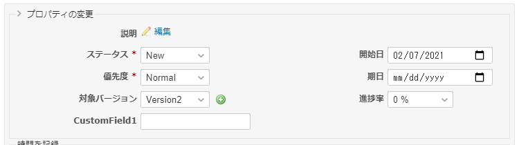
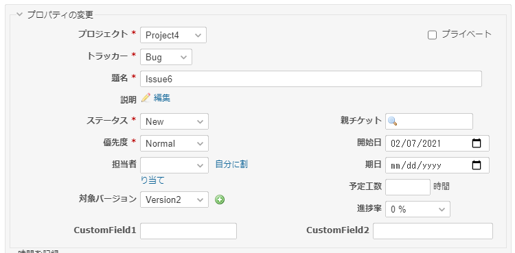

# チケット編集時に表示される項目を限定する
## 説明
チケット編集時に表示される項目を限定します．  
また，「プロパティの変更」をクリックすることで，全項目表示状態へ切り替えることが出来るようにします．

## イメージ
### 表示項目を限定した場合

### 全項目を表示した場合（スクリプトを適用していない状態に等しい）



## 動作確認
- Redmine
  - 4.1.1
- ブラウザ
  - IE11
  - Chrome
  - Edge

## 設定
- パスのパターン: /issues/[0-9]+
- 種別: JavaScript

## コード
```JavaScript
$(function() {
    // ---- 設定 ここから -----

    // 表示を限定したい項目
    var hide_list = [
        'issue_is_private', // プライベート
        'issue_project_id', // プロジェクト
        'issue_tracker_id', // トラッカー
        'issue_subject', // 題名
        'issue_parent_issue_id', // 親チケット
        // 'issue_status_id',  // ステータス
        'issue_assigned_to_id', //担当者
        // 'issue_fixed_version_id', // 対象バージョン
        // 'issue_done_ratio', // 進捗率
        // 'issue_priority_id', // 優先度
        // 'issue_description', // 説明
        // 'issue_start_date', // 開始日
        // 'issue_due_date', // 期日
        'issue_estimated_hours', // 予定工数
        // 'issue_custom_field_values_1', // カスタムフィールド1 サンプル
        'issue_custom_field_values_2', // カスタムフィールド2 サンプル
    ];

    // 初期状態
    var initial_state_show = false;  // 表示しない

    // ---- 設定 ここまで -----


    var legend = $('#all_attributes').parent().children('legend').first();

    function show_attribute(show) {
        // set status
        $('#all_attributes').attr('display_limit', show);

        // set icon
        if (show) {
            var icon_url = '../images/arrow_down.png';  // ∨ アイコン
        } else {
            var icon_url = '../images/arrow_right.png';  // > アイコン
        }
        legend.css({
            'padding-left': '16px',
            'background': 'url(' + icon_url + ') no-repeat 0% 40%',
            'cursor': 'pointer'
        });

        // display/hide
        $('#all_attributes p').each(function(i, elem) {
            // p>labelにforが設定されている場合
            var key = $(elem).children('label').attr('for');

            // pにidが設定されている場合
            key = (key === undefined) ? $(elem).attr('id') : key;

            // 対象のkeyがリストに登録されていた場合，要素を表示/非表示する
            if (key != undefined && hide_list.indexOf(key) > -1) {
                show ? $(elem).show() : $(elem).hide();
            }
        });
    }

    // マウスクリックイベントを設定する
    legend.on('click', function(){
        show_attribute($('#all_attributes').attr('display_limit') == 'false');
    })
    
    // 初期状態
    $('#all_attributes').attr('display_limit', !initial_state_show);
    show_attribute(initial_state_show);

    // ステータス変更時などにDOMが差し替えられるので
    // フォームの内容が書き変わるたびに表示を反映する
    var _replaceIssueFormWith = replaceIssueFormWith;
    replaceIssueFormWith = function(html){
        _replaceIssueFormWith(html);
        show_attribute($('#all_attributes').attr('display_limit') == 'false');
    };
});
```
