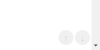

# ページ最上部または最下部にスクロールするボタンを追加する
## 説明
ページ最上部または最下部にスクロールするボタンをウィンドウの右下に追加します．

## イメージ



## 動作確認環境
- Redmine
  - 4.1.1
- ブラウザ
  - IE11
  - Chrome
  - Edge

## 設定
- パスのパターン:
- 種別: JavaScript

## コード
```JavaScript
$(function () {
    const BUTTON_SIZE = '30px';
    const BUTTON_TITLE_UP = '上へ';
    const BUTTON_TITLE_BOTTOM = '下へ';
    const DURATION = 500;

    var btn_basestyle = {
        'position': 'fixed',
        'width': BUTTON_SIZE,
        'height': BUTTON_SIZE,
        'left': 'calc(100vw - ' + BUTTON_SIZE + ' - 20px)',
        'top': 'calc(100vh - ' + BUTTON_SIZE + ' - 10px)',
        'border-radius': '50%',
        'cursor': 'pointer',
        'background-color': '#CCC',
        'opacity': '0.3',
        'z-index': 500,
        'display': 'flex',
        'justify-content': 'center',
        'align-items': 'center',
    }

    function scroll_up() {
        $('html,body').animate({
            scrollTop: 0
        }, DURATION);
    };

    function scroll_bottom() {
        $('html,body').animate({
            scrollTop: $(document).height() - $(window).height()
        }, DURATION);
    };

    var btn_up = $('<div><span>↑</span></div>')
        .css(btn_basestyle)
        .css({
            'left': 'calc(100vw - (' + BUTTON_SIZE + ')*2.1 - 20px)'
        })
        .click(scroll_up)
        .attr('title', BUTTON_TITLE_UP);

    var btn_bottom = $('<div><span>↓</span></div>')
        .css(btn_basestyle)
        .click(scroll_bottom)
        .attr('title', BUTTON_TITLE_BOTTOM);

    $('html body').append(btn_up);
    $('html body').append(btn_bottom);
});
```
