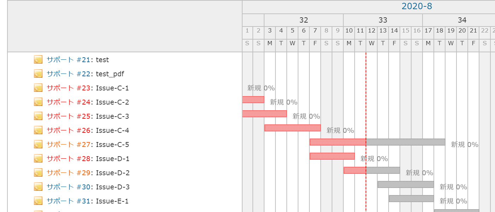
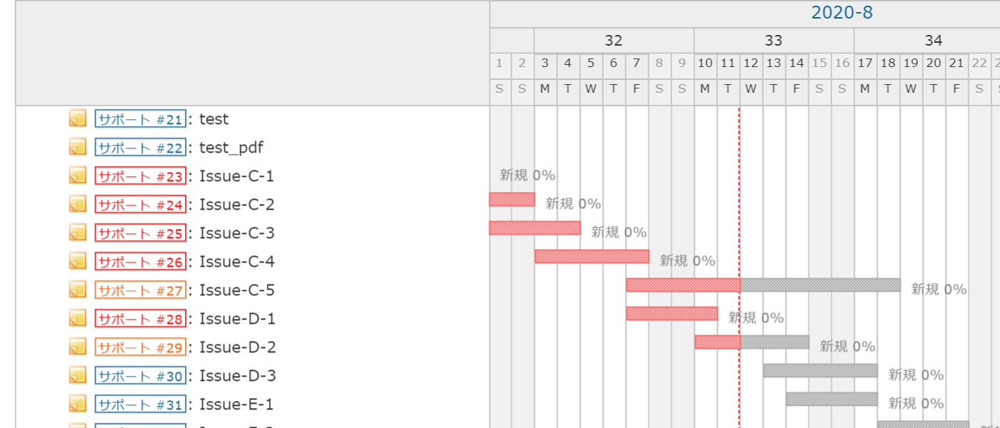

# ガントチャートのトラッカー名とチケットID，チケット名の区別を明確にする
## 説明
ガントチャートのトラッカー名とチケットID，チケット名のデザインを変更し，区別を明確にします．  

## イメージ
### Before


### After



## 設定
- パスのパターン: /gantt
- 種別: CSS

## コード
```CSS
.gantt_subjects{
    font-size: 0.9em;
}
.gantt_subjects a.issue{
    font-size: 0.85em;
    padding: 0 0.2em;
    border: 1px solid;
    display: inline-block;
    line-height: 1.1em;
}
```
